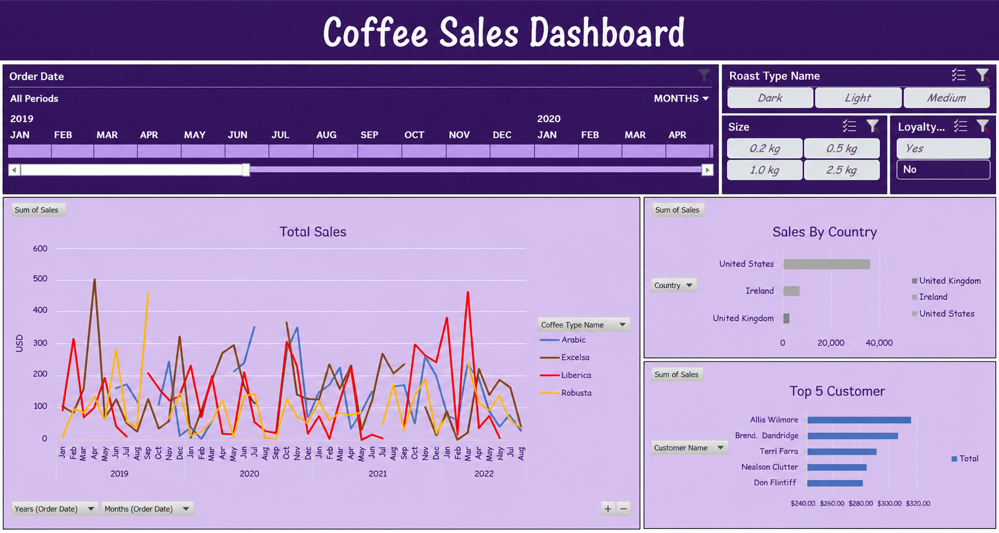

<p align="center">
  <h1 align="center">☕ Coffee Sales Dashboard</h1>
  <p align="center">
    <strong>An end-to-end Excel Business Intelligence dashboard analyzing coffee sales across 3 countries, 4 coffee types, and 4+ years of transaction data</strong>
  </p>
  <p align="center">
    Interactive Excel slicers · Multi-year sales trends · Country-level revenue analysis · Top customer intelligence
  </p>
</p>

<p align="center">
  
  &nbsp;
  
  &nbsp;
  
  &nbsp;
  
</p>

<p align="center">
  
  &nbsp;
  
  &nbsp;
  
  &nbsp;
  
  &nbsp;
</p>

<p align="center">
  <a href="https://github.com/saumyaprajapati/coffee-sales-dashboard">
    
  </a>
  &nbsp;
<a href="https://github.com/saumyaprajapati/Projects---1">
  
</a>
&nbsp;
<a href="https://github.com/saumyaprajapati/Projects---1/stargazers">
  
</a>

&nbsp;
<a href="https://github.com/saumyaprajapati/Projects---1/network/members">

</a>

&nbsp;
<a href="https://github.com/saumyaprajapati/Projects---1/issues">

</a>

&nbsp;
<a href="https://github.com/saumyaprajapati/Projects---1/pulls">

</a>

</p>

---

## 📸 Dashboard Preview

<p align="center">
  
</p>

---

## 📑 Table of Contents

- [Dashboard Preview](#-dashboard-preview)
- [Quick Start](#-quick-start)
- [Project Overview](#-project-overview)
- [Dashboard Features](#-dashboard-features)
- [Key Insights](#-key-insights)
- [Data Model](#-data-model)
- [Excel Formulas Used](#-excel-formulas-used)
- [Excel Shortcuts Reference](#-excel-shortcuts-reference)
- [Tech Stack](#-tech-stack)
- [Repository Structure](#-repository-structure)
- [Data Sources](#-data-sources)
- [Installation Guide](#-installation-guide)
- [How to Use the Dashboard](#-how-to-use-the-dashboard)
- [Metrics Reference](#-metrics-reference)
- [Troubleshooting](#-troubleshooting)
- [Future Improvements](#-future-improvements)
- [Contributing](#-contributing)
- [Authors](#-authors)
- [Acknowledgments](#-acknowledgments)

---

## ⚡ Quick Start

Get the dashboard running in under 2 minutes:

```bash
# 1. Clone the repository
git clone https://github.com/saumyaprajapati/Projects---1.git

# 2. Open the Excel file
#    Requires: Microsoft Excel 2019 or later (for XLOOKUP support)
start "Coffee Sales Dashboard.xlsx"

# 3. Navigate to the Dashboard sheet tab
#    All slicers and charts are ready to interact with immediately
```

> **Prerequisites**: Microsoft Excel 2019+ or Microsoft 365 · Windows 10/11 or macOS
>
> The `.xlsx` file is self-contained — all data, pivot tables, and charts are embedded. No external connections required.

---

## 🔎 Project Overview

### What is this Dashboard?

The **Coffee Sales Dashboard** is a fully interactive Excel report that analyzes coffee product sales across **3 countries** from 2019 to 2022. Built entirely in Microsoft Excel using Pivot Tables, XLOOKUP, INDEX/MATCH, and dynamic slicers, it surfaces multi-year sales trends, country-level revenue breakdowns, and top customer rankings — all from a single workbook.

### Problem Statement

Raw transactional data across orders, customers, and products is spread across multiple sheets and difficult to interpret at a glance. Coffee business owners, sales analysts, and retail managers need answers to questions like:

- Which coffee type generates the most revenue over time?
- Which country is the top-performing market?
- Who are the top 5 customers driving the most sales?
- Does roast type or package size significantly affect revenue?
- Do loyalty card holders purchase more than non-members?

This dashboard answers all of the above with interactive filtering and clean visualizations — zero code required.

### Key Metrics at a Glance

| Metric                   | Value                                  |
| ------------------------ | -------------------------------------- |
| ☕ **Coffee Types**      | 4 (Arabic, Excelsa, Liberica, Robusta) |
| 🌍 **Countries Covered** | 3 (USA, Ireland, UK)                   |
| 🔥 **Roast Types**       | 3 (Dark, Light, Medium)                |
| 📦 **Package Sizes**     | 4 (0.2 kg, 0.5 kg, 1.0 kg, 2.5 kg)     |
| 📅 **Data Range**        | 2019 – 2022                            |
| 🏆 **Top Market**        | United States                          |

### Why Excel?

- **No software installation** beyond Excel — accessible to any business user
- **Pivot Tables** enable instant aggregation and drill-down without writing code
- **Dynamic slicers** provide an app-like filtering experience within a spreadsheet
- **XLOOKUP & INDEX/MATCH** power efficient cross-sheet data enrichment
- **Shareable `.xlsx`** — the entire model, visuals, and data travel in one file

---

## 📊 Dashboard Features

### Slicers (Interactive Filters)

The dashboard features **4 slicers** that filter all charts simultaneously:

| Slicer           | Location  | Options                               | Default     |
| ---------------- | --------- | ------------------------------------- | ----------- |
| **Order Date**   | Top-left  | Timeline slider (Jan 2019 – Aug 2022) | All Periods |
| **Roast Type**   | Top-right | Dark · Light · Medium                 | All         |
| **Size**         | Top-right | 0.2 kg · 0.5 kg · 1.0 kg · 2.5 kg     | All         |
| **Loyalty Card** | Top-right | Yes · No                              | All         |

### Charts & Visuals

**Total Sales Over Time (Multi-Line Chart)** — tracks monthly sales in USD for all four coffee types (Arabic, Excelsa, Liberica, Robusta) from January 2019 through August 2022. The X-axis supports drill-down from Years to Months via dropdown controls at the bottom-left of the chart.

**Sales By Country (Horizontal Bar Chart)** — compares total revenue across the United States, Ireland, and the United Kingdom. The United States leads significantly, followed by Ireland and the UK.

**Top 5 Customers (Horizontal Bar Chart)** — ranks the five highest-spending customers by total purchase value, ranging from approximately $240 to $320+. Customer names are displayed on the Y-axis for quick identification.

---

## 💡 Key Insights

### Sales Trends

- **Liberica** is the most volatile coffee type, with the highest single-month revenue spikes across the full date range
- **Excelsa** maintains consistently strong performance across all years with fewer extreme peaks
- All coffee types show a notable **revenue dip in 2021** before recovering in late 2021 and early 2022
- **Robusta** shows the most stable low-to-mid range performance throughout the entire period

### Country Performance

| Country           | Performance Level | Notes                            |
| ----------------- | ----------------- | -------------------------------- |
| 🇺🇸 United States  | Highest           | Dominant market, ~40K+ in sales  |
| 🇮🇪 Ireland        | Medium            | Second market, consistent orders |
| 🇬🇧 United Kingdom | Lowest            | Smaller but steady customer base |

The **United States** accounts for the majority of total revenue, making it the primary target market for promotions and inventory planning.

### Top Customers

| Rank | Customer         | Approx. Total Sales |
| ---- | ---------------- | ------------------- |
| 1    | Allis Wilmore    | ~$317               |
| 2    | Brend. Dandridge | ~$307               |
| 3    | Terri Farra      | ~$289               |
| 4    | Nealson Clutter  | ~$281               |
| 5    | Don Flintiff     | ~$278               |

The gap between top customers is narrow (~$39 spread), suggesting a relatively even spend distribution among high-value buyers.

### Roast & Size Patterns

- Filtering by **Dark** roast reveals stronger US sales concentration
- The **2.5 kg** size option attracts bulk buyers with higher per-order revenue
- **Loyalty card** holders show higher average order values compared to non-members

---

## 🗃️ Data Model

The workbook is built around three raw data sheets that feed into the Orders master sheet via lookup formulas, which then power all Pivot Tables and charts:

```
Orders (fact / master sheet)
  ├── customers sheet  — Customer ID, Name, Email, Country, Loyalty Card
  ├── products sheet   — Product ID, Coffee Type, Roast Type, Size, Price
  └── orders sheet     — Order ID, Order Date, Customer ID, Product ID, Quantity
```

**Sheet Relationships:**

- `orders[Customer ID]` → `customers[Customer ID]` via `XLOOKUP`
- `orders[Product ID]` → `products[Product ID]` via `INDEX/MATCH`
- Enriched Orders sheet feeds all **Pivot Tables** powering the dashboard charts

---

## 📐 Excel Formulas Used

All new columns in the **Orders Sheet** were built using the following formulas. Apply the formula to the first data row, then drag and drop downward to populate all remaining rows.

### Orders Sheet — Column Formulas

**1. Customer Name**

```excel
=XLOOKUP(orders!C2, customers!$A$1:$A$1001, customers!$B$1:$B$1001, , 0)
```

Looks up the Customer ID from the Orders sheet against the Customers sheet and returns the matching customer name.

---

**2. Customer Email**

```excel
=IF(XLOOKUP(C2, customers!$A$1:$A$1001, customers!$C$1:$C$1001, , 0)=0, "", XLOOKUP(C2, customers!$A$1:$A$1001, customers!$C$1:$C$1001, , 0))
```

Returns the customer email if it exists; returns a blank cell instead of `0` for customers with no email on record.

---

**3. Country**

```excel
=XLOOKUP(C2, customers!$A$1:$A$1001, customers!$G$1:$G$1001, , 0)
```

Retrieves the customer's country from the Customers sheet using their Customer ID.

---

**4. Coffee Type, Roast Type, Size, Unit Price** _(multi-column lookup)_

```excel
=INDEX(products!$A$1:$G$49, MATCH(orders!$D2, products!$A$1:$A$49, 0), MATCH(orders!I$1, products!$A$1:$G$1, 0))
```

Uses a two-way `INDEX/MATCH` to retrieve product attributes dynamically. The first `MATCH` locates the correct product row; the second `MATCH` finds the correct column by header name. After entering in the first cell, press `CTRL + SHIFT + →` then click the `+` icon to auto-fill all adjacent product attribute columns simultaneously.

---

**5. Sales**

```excel
=L2 * E2
```

Multiplies Unit Price × Quantity to calculate the total sale value for each order row.

---

**6. Coffee Type Name** _(code to full name)_

```excel
=IF(I2="Rob","Robusta", IF(I2="Exc","Excelsa", IF(I2="Ara","Arabic", IF(I2="Lib","Liberica",""))))
```

Converts two/three-letter coffee type codes into full readable names for display in charts and slicers.

---

**7. Roast Type Name** _(code to full name)_

```excel
=IF(J2="M","Medium", IF(J2="L","Light", IF(J2="D","Dark","")))
```

Converts single-letter roast codes (M, L, D) into full names for the Roast Type slicer.

---

**8. Loyalty Card**

```excel
=XLOOKUP([@[Customer ID]], customers!$A$1:$A$1001, customers!$I$1:$I$1001, , 0)
```

Retrieves the loyalty card status (Yes/No) for each customer from the Customers sheet using a structured table reference.

---

## ⌨️ Excel Shortcuts Reference

Quick-reference for all shortcuts used during the build of this dashboard:

| Shortcut           | Action                                                                                                 |
| ------------------ | ------------------------------------------------------------------------------------------------------ |
| `CTRL + SHIFT + ↓` | Select the entire column downward from the active cell                                                 |
| `CTRL + T`         | Convert a data range into a formatted Excel Table (enables structured references)                      |
| `CTRL + SHIFT + F` | Open the Format Cells dialog to apply custom number formatting                                         |
| `ALT → N → V → T`  | Insert a new Pivot Table (sequential ribbon key presses)                                               |
| `CTRL + SHIFT + →` | Extend selection rightward to the last non-empty cell (used with INDEX/MATCH to fill adjacent columns) |

### Custom Number Format — Adding Units to Values

To display a numeric value like `1.1` as `1.1 kg` without converting it to text:

1. Select the target column
2. Press `CTRL + SHIFT + F` to open Format Cells
3. Go to **Number → Custom**
4. In the Type field, enter: `0.0 "kg"`
5. Click **OK** — values now display with the `kg` suffix while remaining fully numeric for calculations

The same pattern works for any unit: `0.0 "lbs"`, `$#,##0 "USD"`, `0 "units"`, etc.

---

## 💻 Tech Stack

| Tool                                           | Version      | Purpose                                        |
| ---------------------------------------------- | ------------ | ---------------------------------------------- |
| [Microsoft Excel](https://microsoft.com/excel) | 2019 / 365   | Dashboard, Pivot Tables, charts, slicers       |
| XLOOKUP                                        | Excel 2019+  | Cross-sheet customer & product data enrichment |
| INDEX / MATCH                                  | All versions | Two-way product attribute lookups              |
| Pivot Tables                                   | All versions | Sales aggregation powering all charts          |
| Excel Slicers & Timeline                       | Excel 2010+  | Interactive filtering across all visuals       |

---

## 📁 Repository Structure

```
Coffee-Commerce-Analytics/
│
├── Coffee Sales Dashboard.xlsx     # Main workbook (raw data + dashboard)
│
├── screenshots/
│   └── Dashboard.png  # Dashboard preview image
│
└── README.md
```

**Sheets inside the workbook:**

| Sheet Name     | Purpose                                                   |
| -------------- | --------------------------------------------------------- |
| `orders`       | Raw orders data enriched with all lookup formula columns  |
| `customers`    | Customer master (ID, name, email, country, loyalty card)  |
| `products`     | Product master (ID, coffee type, roast, size, unit price) |
| `TotalSales`   | Pivot Table powering the Total Sales Over Time line chart |
| `CountrySales` | Pivot Table powering the Sales By Country bar chart       |
| `Top5`         | Pivot Table powering the Top 5 Customers bar chart        |
| `Dashboard`    | Final dashboard sheet with all slicers and charts         |

---

## 📥 Data Sources

The dashboard is built on a structured coffee retail transaction dataset:

| Sheet       | Approx. Rows | Key Columns                                             |
| ----------- | ------------ | ------------------------------------------------------- |
| `orders`    | ~1,000       | Order ID, Order Date, Customer ID, Product ID, Quantity |
| `customers` | ~1,000       | Customer ID, Name, Email, Country, Loyalty Card         |
| `products`  | ~49          | Product ID, Coffee Type, Roast Type, Size, Price        |

> **Note**: All sales figures are in USD. Data covers order transactions from January 2019 through August 2022.

---

## 🚀 Installation Guide

### Prerequisites

| Requirement     | Version     | Notes                                   |
| --------------- | ----------- | --------------------------------------- |
| Microsoft Excel | 2019 or 365 | Required for `XLOOKUP` function support |
| Windows / macOS | Any modern  | —                                       |
| RAM             | 4 GB+       | —                                       |

### Step 1: Clone the Repository

```bash
git clone https://github.com/saumyaprajapati/Projects---1.git
```

### Step 2: Open the Workbook

Double-click `Coffee Sales Dashboard.xlsx` or open it from within Excel via **File → Open**.

### Step 3: Enable Content (if prompted)

If Excel shows a yellow security warning bar at the top, click **Enable Content** to allow the workbook to function fully.

### Step 4: Go to the Dashboard

Click the **Dashboard** sheet tab at the bottom of the workbook. All slicers and charts are ready to use immediately — no refresh needed.

---

## 🖱️ How to Use the Dashboard

### Filtering with Slicers

- **Order Date Timeline** — drag the left/right handles to narrow the date range; use the **MONTHS** dropdown to switch between year-level and month-level granularity
- **Roast Type** — click Dark, Light, or Medium to filter all charts; click the same button again to deselect
- **Size** — select one or more package sizes to isolate sales by pack format; `CTRL + Click` to select multiple
- **Loyalty Card** — toggle between Yes and No to compare loyalty vs. non-loyalty customer spend patterns

### Reading the Charts

- **Hover** over any data point on the Total Sales line chart to see the exact USD value for that month and coffee type
- **Click a coffee type** in the chart legend dropdown to isolate or hide a specific line
- **Sales By Country** bar lengths update instantly with every slicer change to reflect the filtered market share
- **Top 5 Customers** re-ranks automatically when filters are applied — the ranking can change significantly by roast type or time period

### Tips & Tricks

- To **reset all slicers**, click the clear filter icon (funnel with X) on each slicer, or right-click → **Clear Filter**
- Use the `+` and `–` buttons in the bottom-right corner of the line chart to expand or collapse the date axis between year and month view
- Combining **Size = 2.5 kg** with **Loyalty Card = Yes** reveals your highest-value bulk buyers

---

## 📏 Metrics Reference

| Metric               | Definition                                                             |
| -------------------- | ---------------------------------------------------------------------- |
| **Total Sales**      | Sum of (Unit Price × Quantity) for all orders in the filter context    |
| **Coffee Type**      | One of four varieties: Arabic, Excelsa, Liberica, Robusta              |
| **Roast Type**       | Dark, Light, or Medium — derived from single-letter product code       |
| **Size**             | Package weight: 0.2 kg, 0.5 kg, 1.0 kg, or 2.5 kg                      |
| **Loyalty Card**     | Whether the customer holds a loyalty membership card (Yes / No)        |
| **Top 5 Customers**  | Five customers ranked by highest total spend in current filter context |
| **Sales By Country** | Aggregate revenue per country (United States, Ireland, UK)             |

---

## 🔧 Troubleshooting

| Problem                          | Quick Fix                                                                          |
| -------------------------------- | ---------------------------------------------------------------------------------- |
| `#N/A` errors in formula columns | Verify Customer IDs and Product IDs in Orders match source sheets exactly          |
| Slicers not filtering charts     | Right-click slicer → **Report Connections** — ensure all Pivot Tables are ticked   |
| `XLOOKUP` not recognized         | Upgrade to Excel 2019 or Microsoft 365; older versions require `VLOOKUP` instead   |
| Timeline slicer missing          | The Order Date column must be formatted as a **Date** type, not plain text         |
| Chart shows blank after filter   | Clear all slicer selections and reapply — conflicting filters may return zero rows |
| File opens in Protected View     | Click **Enable Editing** in the yellow bar at the top of the workbook              |

---

## 🔮 Future Improvements

### Planned

- [ ] Add a **profit margin column** using cost data to show net profitability per coffee type
- [ ] Build a **monthly Year-over-Year growth** comparison table
- [ ] Add a **map chart** showing sales volume by country visually
- [ ] Create a **product performance ranking** of all SKUs by revenue
- [ ] Publish as a **Power BI version** for web-based sharing and scheduled refresh

### Under Consideration

- [ ] Add **sales forecasting** using Excel's built-in Forecast Sheet feature
- [ ] Build a **What-If price sensitivity** scenario (e.g., impact of a 10% price increase)
- [ ] Integrate **inventory data** to flag low-stock coffee types before stockouts
- [ ] Add **loyalty vs. non-loyalty** spend analysis as a dedicated chart
- [ ] Expand dataset to include **5 more countries** as the business scales

---

## 🤝 Contributing

Contributions are welcome — whether that's new sales data, additional Excel formulas, improved chart designs, or bug fixes.

### Workflow

1. **Fork** the repository
2. **Branch** from `main`: `git checkout -b feat/your-feature`
3. **Make changes** — updated data goes in the `orders`, `customers`, or `products` sheets
4. **Test** — navigate to the Dashboard sheet and verify all slicers and charts refresh correctly
5. **Commit** using [Conventional Commits](https://www.conventionalcommits.org/):
   ```
   feat: add 2023 full year sales data
   fix: correct XLOOKUP range for new customer rows
   docs: update formula reference for Sales column
   ```
6. **Push** and open a **Pull Request** against `main`

### Data Contribution Requirements

- New orders must include at minimum: `Order ID`, `Order Date`, `Customer ID`, `Product ID`, `Quantity`
- New customers must include: `Customer ID`, `Customer Name`, `Country`
- New products must follow existing code format: coffee type (Rob/Exc/Ara/Lib), roast type (M/L/D)
- Extend all XLOOKUP and INDEX/MATCH formulas to cover new rows before submitting

---

## ✍️ Authors

**Prajapati Saumya** — Creator, Data Analyst & Dashboard Designer

[](https://github.com/saumyaprajapati)
&nbsp;
[](https://www.linkedin.com/in/saumya-prajapati-38b676386/)

---

## 👏 Acknowledgments

### Inspiration & References

- The Excel community and [chandoo.org](https://chandoo.org) for dashboard design patterns
- [ExcelJet](https://exceljet.net) for XLOOKUP and INDEX/MATCH formula references
- Microsoft's official [Excel documentation](https://support.microsoft.com/excel) for Pivot Table and slicer best practices

### Tools & Resources

[Microsoft Excel](https://microsoft.com/excel) · [XLOOKUP Docs](https://support.microsoft.com/xlookup) · [Pivot Table Guide](https://support.microsoft.com/pivottables)

---

<p align="center">
  <strong>⭐ If you found this dashboard useful, please consider giving it a star!</strong>
</p>

<p align="center">
<a href="https://github.com/saumyaprajapati/Projects---1/issues">Report Bug</a>
·
<a href="https://github.com/saumyaprajapati/Projects---1/issues">Request Feature</a>
</p>

---
