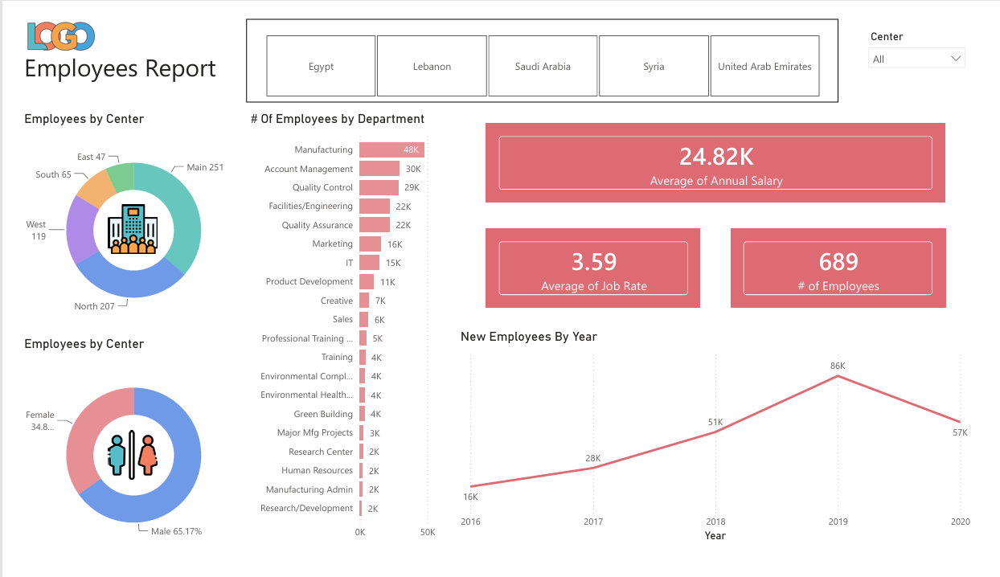
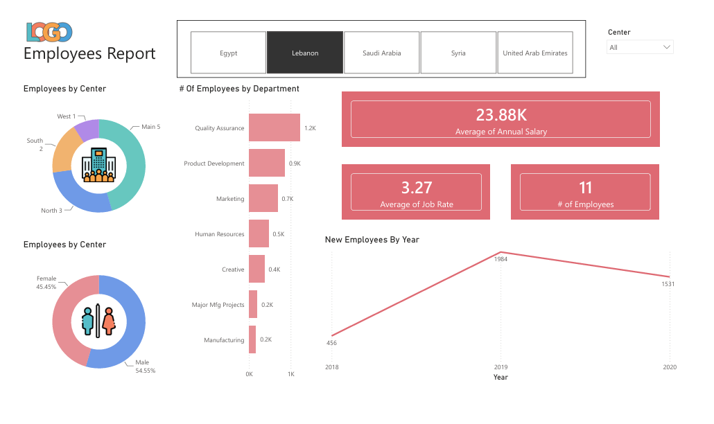
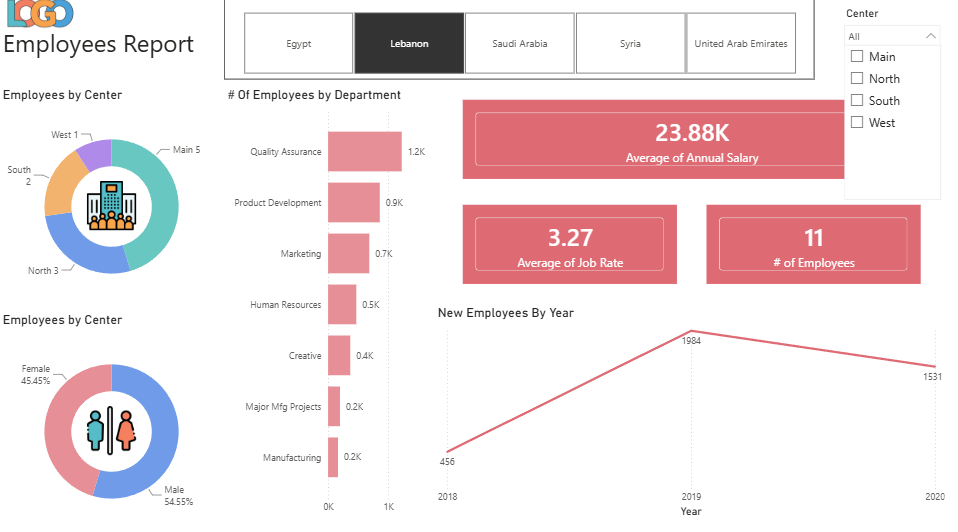

<p align="center">
  <h1 align="center">📊 Employees Report Dashboard</h1>
</p>

<p align="center">
  <b>An interactive Power BI dashboard analyzing employee distribution, salary trends, and hiring patterns across multiple regional centers.</b><br>
  Multi-Country Filtering · Department Breakdown · Gender Analysis · Hiring Trends · KPI Cards
</p>

<p align="center">
  
  
</p>

<p align="center">
  
  
  
  
  
</p>

<p align="center">
  
  
  
  
  
</p>

---

## 📸 Dashboard Preview

<p align="center">
  
</p>

<p align="center">
  
</p>

<p align="center">
  
</p>

---

## 📁 Table of Contents

- [Quick Start](#quick-start)
- [Project Overview](#project-overview)
- [Dashboard Features](#dashboard-features)
- [Key Insights](#key-insights)
- [Data Model](#data-model)
- [Power BI Technical Details](#power-bi-technical-details)
- [Tech Stack](#tech-stack)
- [Repository Structure](#repository-structure)
- [Data Sources](#data-sources)
- [Installation Guide](#installation-guide)
- [How to Use the Dashboard](#how-to-use-the-dashboard)
- [Metrics Reference](#metrics-reference)
- [Troubleshooting](#troubleshooting)
- [Future Improvements](#future-improvements)
- [Contributing](#contributing)
- [Authors](#authors)
- [Acknowledgments](#acknowledgments)

---

## ⚡ Quick Start

**Prerequisites:** Power BI Desktop (any recent version), Windows OS, minimum 4GB RAM.

```bash
git clone https://github.com/saumyaprajapati/Projects---1.git
cd Projects---1
# Open the .pbix file in Power BI Desktop
```

The `.pbix` file is fully self-contained. No external data connections or credentials are required — the mock dataset is embedded directly in the report.

---

## 📌 Project Overview

### What is this Dashboard?

The Employees Report Dashboard is a single-page Power BI report built to analyze workforce data across five regional centers — Egypt, Lebanon, Saudi Arabia, Syria, and the United Arab Emirates. It presents employee headcount, salary averages, job rate averages, gender distribution, and year-over-year hiring trends through a clean, interactive layout. The dashboard was built entirely using native Power BI visuals and interactions without any custom DAX measures or calculated columns.

### Problem Statement

This dashboard was designed to answer the following business questions:

- How are employees distributed across different regional centers and sub-centers?
- Which departments employ the most staff, and how do they compare in size?
- What is the average annual salary and job rate across the workforce?
- How has the volume of new employee hires changed year over year from 2016 to 2020?

### Key Metrics at a Glance

| Metric | Value (All Centers) |
|---|---|
| 👥 Total Employees | 689 |
| 💰 Average Annual Salary | 24.82K |
| ⭐ Average Job Rate | 3.59 |
| 🏢 Departments | 20+ |
| 🌍 Countries | 5 |
| 📅 Data Range | 2016 – 2020 |

### Why Power BI?

- Native donut charts, bar charts, and line charts make multi-category comparisons effortless without any coding.
- Cross-filtering between visuals is built-in — clicking any slice or bar automatically filters the entire page.
- Button-style slicers for country selection provide a clean, intuitive navigation experience.
- KPI cards render summary metrics instantly and update dynamically as filters are applied.
- The dropdown slicer for Center allows granular sub-center filtering within each country view.

---

## 📊 Dashboard Features

### Slicers / Filters

| Slicer Name | Location | Options | Default |
|---|---|---|---|
| Country Tabs | Top Center | Egypt, Lebanon, Saudi Arabia, Syria, United Arab Emirates | All (no selection) |
| Center Dropdown | Top Right | All, Main, North, South, West | All |

### Charts & Visuals

**Employees by Center (Donut Chart — Top Left):** This donut chart breaks down total employee headcount by sub-center — Main, North, South, East, and West. In the all-centers view, Main leads with 251 employees, followed by North (207), West (119), South (65), and East (47). Each segment is color-coded, and hovering reveals the exact count. When a country filter is applied, the donut dynamically recalculates to show only that country's center distribution.

**Employees by Gender (Donut Chart — Bottom Left):** This second donut chart displays the male-to-female split within the filtered dataset. In the default all-centers view, males account for 65.17% of the workforce while females make up 34.83%. Filtering by a specific country such as Lebanon shifts the ratio noticeably — males at 54.55% and females at 45.45% — reflecting different workforce compositions per region.

**Number of Employees by Department (Horizontal Bar Chart — Center):** This bar chart ranks all departments by their employee count. Manufacturing is the largest department at 48K (aggregate count), followed by Account Management at 30K and Quality Control at 29K. The chart scrolls to accommodate all 20+ departments, giving a complete picture of organizational structure. When filtered to a single country like Lebanon, only the departments present in that region appear, with Quality Assurance topping the list at 1.2K.

**Average of Annual Salary (KPI Card — Top Right):** This large KPI card displays the average annual salary across all employees in the current filter context. The overall figure is 24.82K, which drops slightly to 23.88K when filtered to Lebanon alone, indicating regional salary variation.

**Average of Job Rate (KPI Card — Middle Right):** This card shows the average job performance or grading rate across filtered employees. The overall average is 3.59, while Lebanon's average stands at 3.27, suggesting performance benchmarks differ by region.

**Number of Employees (KPI Card — Middle Right):** Displayed alongside the job rate card, this metric shows the total headcount for the current filter selection — 689 in the all-centers view and 11 when filtered to Lebanon.

**New Employees by Year (Line Chart — Bottom Right):** This line chart plots the annual intake of new employees from 2016 through 2020. Hiring grew steadily from 16K in 2016 to a peak of 86K in 2019, followed by a notable decline to 57K in 2020. For Lebanon specifically, the trend runs from 456 new hires in 2018 up to 1,984 in 2019, then down to 1,531 in 2020, mirroring the global dip.

---

## 🔍 Key Insights

### Workforce Distribution

- The Main center is the largest hub, accounting for 251 out of 689 total employees (36.4% of the workforce).
- North is the second-largest center with 207 employees, meaning Main and North together hold over 66% of all staff.
- East is the smallest center with just 47 employees, suggesting it may be a newer or specialized location.
- Lebanon's workforce is remarkably small at only 11 employees spread across 4 centers, indicating it is an emerging or limited-scale operation.

### Department Composition

| Rank | Department | Employee Count |
|---|---|---|
| 1 | Manufacturing | 48K |
| 2 | Account Management | 30K |
| 3 | Quality Control | 29K |
| 4 | Facilities/Engineering | 22K |
| 5 | Quality Assurance | 22K |
| 6 | Marketing | 16K |
| 7 | IT | 15K |

- Manufacturing dominates the department landscape, accounting for the largest share of headcount across all centers.
- Support and administrative departments like Training (4K), Professional Training (5K), and Human Resources (2K) are significantly smaller, reflecting a production-heavy organizational structure.

### Salary & Job Rate

- The overall average annual salary of 24.82K drops to 23.88K in Lebanon, a difference of approximately 3.8%, pointing to regional pay scale differences.
- The average job rate of 3.59 overall versus 3.27 in Lebanon suggests employees in Lebanon are rated slightly lower on average, which could reflect tenure, department mix, or rating scale differences by region.

### Hiring Trends

- New employee intake grew by over 400% between 2016 (16K) and 2019 (86K), indicating a significant expansion phase.
- The 2020 dip to 57K (a 34% drop from the 2019 peak) is consistent with global hiring slowdowns during that period.
- Lebanon's hiring data only begins in 2018, suggesting the country office was established mid-dataset.

---

## 🗃️ Data Model

Since this project uses a single flat dataset loaded directly into Power BI without any additional tables, relationships, or calculated columns, the data model is a single-table flat schema.

```
Employees Dataset (Flat Table)
└── employees_data    ← single fact table
        ├── Employee ID
        ├── Center
        ├── Country
        ├── Department
        ├── Gender
        ├── Annual Salary
        ├── Job Rate
        └── Hire Year
```

All visuals on the dashboard draw directly from this single table. No star schema, no dimension tables, and no table relationships are present in this model.

---

## ⚙️ Power BI Technical Details

### DAX Measures

No custom DAX measures were created for this project. All KPI values — Average of Annual Salary, Average of Job Rate, and Count of Employees — are derived using Power BI's built-in aggregation options (Average, Count) applied directly to dataset columns via the Fields pane. No calculated columns were added either; the dataset was used exactly as provided.

### Power Query / M Transformations

No Power Query transformations were applied. The dataset was loaded into Power BI in its raw form without any cleaning steps, column additions, type changes, or filtering in the Query Editor.

### Slicer & Filter Interaction Logic

The country selector at the top of the report uses a button-style slicer. Clicking any country tab — Egypt, Lebanon, Saudi Arabia, Syria, or United Arab Emirates — filters all visuals on the page simultaneously via Power BI's built-in cross-filter propagation. The Center dropdown slicer in the top-right corner provides a secondary filter layer, allowing users to narrow results to a specific sub-center (Main, North, South, or West) within the selected country. Both slicers interact with all visuals on the page, including both donut charts, the bar chart, all three KPI cards, and the line chart.

### Cross-Filtering Between Visuals

Power BI's default cross-filtering is active. Clicking a department bar in the horizontal bar chart highlights corresponding data across the donut charts and updates the KPI cards. Similarly, clicking a gender segment in the donut chart cross-filters department and year data. No custom interactions or visual-level filters were configured beyond the default behavior.

---

## 🛠️ Tech Stack

| Tool | Version | Purpose |
|---|---|---|
| Power BI Desktop | Latest (2024+) | Dashboard design, data loading, and visual creation |
| Power BI Service | N/A | Optional publishing and sharing |
| Mock Dataset | N/A | Employee records used as-is without transformation |

---

## 📂 Repository Structure

```
Projects---1/
├── EmployeesReport.pbix        ← Main Power BI report file
├── screenshots/
│   ├── Dashboard-1.png         ← All-centers view
│   ├── Dashboard-2.png         ← Lebanon filtered view
│   └── Dashboard-3.png         ← Center dropdown expanded
└── README.md                   ← Project documentation
```

| File | Description |
|---|---|
| `EmployeesReport.pbix` | Self-contained Power BI report with embedded dataset and all visuals |
| `Dashboard-1.png` | Screenshot of the default all-centers dashboard view |
| `Dashboard-2.png` | Screenshot with Lebanon country filter active |
| `Dashboard-3.png` | Screenshot showing the Center dropdown slicer options |
| `README.md` | Full project documentation |

---

## 📋 Data Sources

| Table | Approx. Rows | Key Columns |
|---|---|---|
| employees_data | ~689+ records | Employee ID, Country, Center, Department, Gender, Annual Salary, Job Rate, Hire Year |

The dataset is a mock/sample dataset used for demonstration and learning purposes. It covers employee records from 5 countries across the Middle East region, spanning hire years from 2016 to 2020. Salary values are expressed in thousands (K). No real personally identifiable information is present in the data.

---

## 🚀 Installation Guide

### Prerequisites

| Requirement | Version | Notes |
|---|---|---|
| Power BI Desktop | Any recent version (2023+) | Free download from Microsoft |
| Operating System | Windows 10 / 11 | Power BI Desktop is Windows-only |
| RAM | 4GB minimum, 8GB recommended | For smooth rendering of visuals |
| Storage | ~50MB | For the .pbix file |

### Steps

1. Clone or download this repository:

```bash
git clone https://github.com/saumyaprajapati/Projects---1.git
```

2. Navigate to the project folder:

```bash
cd Projects---1
```

3. Open `EmployeesReport.pbix` in Power BI Desktop by double-clicking the file or using **File → Open** inside Power BI Desktop.

4. The report loads immediately with all data embedded. No login, gateway, or external data source setup is required.

5. To publish to Power BI Service, click **Home → Publish** and select your workspace.

---

## 🧭 How to Use the Dashboard

### Filtering by Country

Click any of the five country buttons at the top of the dashboard — Egypt, Lebanon, Saudi Arabia, Syria, or United Arab Emirates. All visuals update instantly to show data only for that country. To return to the all-countries view, click the same button again to deselect it, or press Ctrl+Z to undo.

### Filtering by Center

Use the **Center** dropdown slicer in the top-right corner to filter by a specific sub-center within the currently selected country. Options include Main, North, South, and West. Select "All" to remove the center filter.

### Cross-Filtering Visuals

Click any bar in the Department bar chart to filter the entire page by that department. Click any segment in the donut charts to filter by center or gender. All KPI cards and the line chart update in real time. Click the same element again or press **Esc** to clear the cross-filter.

### Tips & Tricks

- Hold **Ctrl** and click multiple departments in the bar chart to select more than one at a time.
- Hover over any data point on the line chart to see the exact new-hire count for that year.
- Hover over any donut segment to see the label, value, and percentage in the tooltip.
- Use the **Center** dropdown and country buttons together for the most granular view — for example, Lebanon + Main gives you only Lebanon's Main center data.
- To reset all filters at once, go to **View → Reset to Default** in Power BI Desktop, or refresh the browser tab if viewing in Power BI Service.

---

## 📐 Metrics Reference

| Metric | Definition |
|---|---|
| # of Employees | Count of all employee records in the current filter context |
| Average of Annual Salary | Mean annual salary (in thousands) across all filtered employees |
| Average of Job Rate | Mean job performance rating across all filtered employees |
| New Employees by Year | Count of employees grouped by their hire year, plotted over time |
| Employees by Center | Count of employees grouped by their assigned sub-center (Main, North, South, East, West) |
| Employees by Gender | Count and percentage of male vs female employees in the filtered dataset |
| # of Employees by Department | Count of employees grouped by their department, sorted descending |

---

## 🔧 Troubleshooting

| Problem | Quick Fix |
|---|---|
| `.pbix` file won't open | Ensure Power BI Desktop is installed and updated. Download from [Microsoft's official site](https://powerbi.microsoft.com/desktop/). |
| Visuals appear blank after selecting a filter | The combination of country + center filters may return zero records. Try resetting filters by clicking the active slicer again. |
| Country buttons don't respond | Check if the slicer visual is in focus. Click outside all visuals first, then try the button again. |
| KPI cards show "Blank" instead of a number | This occurs when no records match the current filter combination. Broaden your filter selection. |
| Line chart shows only one data point | The selected country or center may have data for only one year. This is expected for smaller regions like Lebanon (data starts 2018). |
| Dashboard looks different from screenshots | You may be viewing it in Power BI Service vs Desktop. Layout and font rendering can differ slightly between environments. |

---

## 🔮 Future Improvements

### Planned

- [ ] Add a dedicated page for salary analysis with salary bands and distribution histograms
- [ ] Build a department-level drill-through page showing individual employee cards
- [ ] Introduce a date table and time intelligence to enable YoY growth calculations natively
- [ ] Add a tooltip page for the line chart showing department breakdown for each hire year
- [ ] Create a mobile-optimized layout for Power BI Mobile app viewing

### Under Consideration

- [ ] Connect to a live HR data source (e.g., SQL Server or SharePoint) for real-time updates
- [ ] Add bookmarks to toggle between male-only and female-only workforce views
- [ ] Incorporate attrition data to show employee turnover rates alongside hiring trends
- [ ] Add conditional formatting on the KPI cards to flag metrics above or below thresholds

---

## 🤝 Contributing

1. Fork the repository on GitHub.
2. Create a new branch for your feature or fix:

```bash
git checkout -b feature/your-feature-name
```

3. Make your changes and commit using conventional commit format:

```bash
git commit -m "feat: add attrition trend visual to page 2"
git commit -m "fix: correct center slicer default selection"
git commit -m "docs: update README with new screenshots"
```

4. Push your branch and open a Pull Request:

```bash
git push origin feature/your-feature-name
```

5. In the Pull Request description, explain what was changed and why.

**Data contribution requirements:**
- Any new dataset must be mock or anonymized — no real employee PII.
- New columns must be documented in the Data Sources section of this README.
- If new measures or calculated columns are added, document them in the DAX Measures section.

---

## 👩‍💻 Authors

**SAUMYA PRAJAPATI**
Power BI Dashboard Developer

<p>
  <a href="https://github.com/saumyaprajapati">
    
  </a>
  &nbsp;
  <a href="https://www.linkedin.com/in/saumya-prajapati-38b676386">
    
  </a>
</p>

---

## 🙏 Acknowledgments

- Mock employee dataset used for educational and portfolio purposes — no real data was involved.
- [Microsoft Power BI Documentation](https://learn.microsoft.com/en-us/power-bi/) for visual configuration references.
- [shields.io](https://shields.io/) for the badge assets used in this README.
- The Power BI Community forums for general dashboard design inspiration.

---

<p align="center">⭐ If you found this useful, please give it a star!</p>

<p align="center">
  <a href="../../issues/new?template=bug_report.md">Report Bug</a> ·
  <a href="../../issues/new?template=feature_request.md">Request Feature</a>
</p>
