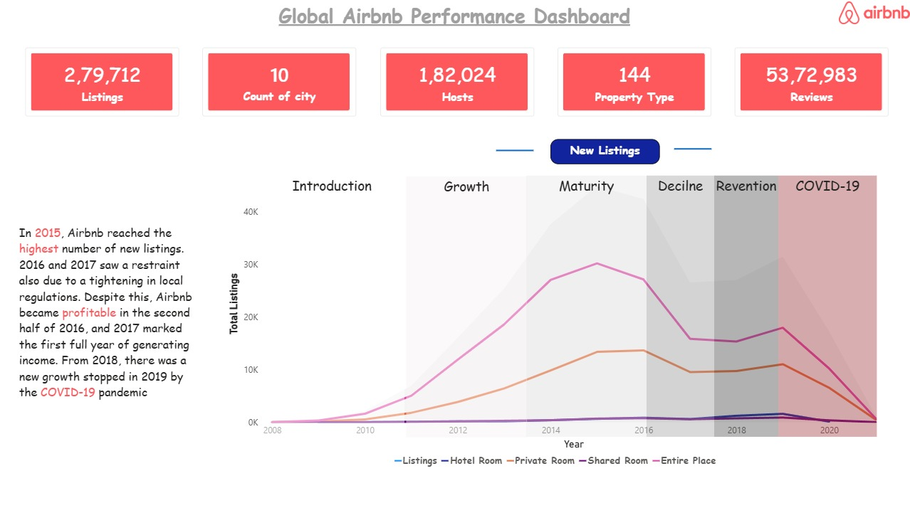
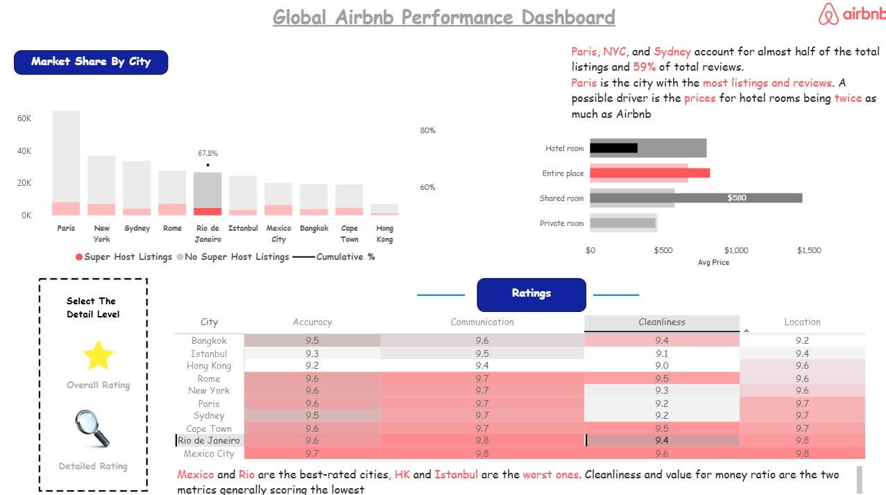

<p align="center">
  <h1 align="center">🏠 Global Airbnb Performance Dashboard</h1>
  <p align="center">
    <strong>An end-to-end Business Intelligence dashboard analyzing Airbnb's global market across 10 cities, 279K+ listings, and 5.3M+ reviews</strong>
  </p>
  <p align="center">
    Interactive Power BI visuals · Market lifecycle analysis · City-level benchmarking · Superhost intelligence
  </p>
</p>

<p align="center">
  
  &nbsp;
  
  &nbsp;
  
  &nbsp;
  
</p>

<p align="center">
  
  &nbsp;
  
  &nbsp;
  
  &nbsp;
  
  &nbsp;
  
</p>

<p align="center">
  <a href="https://github.com/YOUR_USERNAME/global-airbnb-dashboard">
    
  </a>
  &nbsp;
  <a href="https://github.com/YOUR_USERNAME/global-airbnb-dashboard">
    
  </a>
  &nbsp;
  <a href="https://github.com/YOUR_USERNAME/global-airbnb-dashboard/stargazers">
    
  </a>
  &nbsp;
  <a href="https://github.com/YOUR_USERNAME/global-airbnb-dashboard/network/members">
    
  </a>
  &nbsp;
  <a href="https://github.com/YOUR_USERNAME/global-airbnb-dashboard/issues">
    
  </a>
  &nbsp;
  <a href="https://github.com/YOUR_USERNAME/global-airbnb-dashboard/pulls">
    
  </a>
</p>

---

## 📸 Screenshots

<p align="center">
  
</p>
<br>
  <p align="center">
    
  </p>
---

## 📑 Table of Contents

- [Screenshots](#-screenshots)
- [Quick Start](#-quick-start)
- [Project Overview](#-project-overview)
- [Dashboard Pages](#-dashboard-pages)
- [Key Insights](#-key-insights)
- [Data Model](#-data-model)
- [DAX Measures](#-dax-measures)
- [Tech Stack](#-tech-stack)
- [Repository Structure](#-repository-structure)
- [Data Sources](#-data-sources)
- [Installation Guide](#-installation-guide)
- [How to Use the Dashboard](#-how-to-use-the-dashboard)
- [City Coverage](#-city-coverage)
- [Metrics Reference](#-metrics-reference)
- [Performance Considerations](#-performance-considerations)
- [Troubleshooting](#-troubleshooting)
- [Future Improvements](#-future-improvements)
- [Contributing](#-contributing)
- [Authors](#-authors)
- [Acknowledgments](#-acknowledgments)
- [License](#-license)

---

## ⚡ Quick Start

Get the dashboard running in under 3 minutes:

```bash
# 1. Clone the repository
git clone https://github.com/saumyaprajapati/Projects---1.git
cd global-airbnb-dashboard

# 2. Open the Power BI file
#    Requires: Power BI Desktop (free download from Microsoft)
start "Global Airbnb Performance.pbix"

# 3. If prompted, refresh the data source
#    Data > Refresh All
```

> **Prerequisites**: [Power BI Desktop](https://powerbi.microsoft.com/desktop/) (free) · Windows 10/11
>
> The `.pbix` file is self-contained — all data is embedded. No database connection required.

---

## 🔎 Project Overview

### What is this Dashboard?

The **Global Airbnb Performance Dashboard** is a multi-page, interactive Power BI report that dissects Airbnb's worldwide listing data across **10 major cities** spanning 2008–2021. It surfaces market trends, pricing intelligence, city benchmarking, guest satisfaction scores, and the impact of COVID-19 — all in a single, drill-through-enabled report.

### Problem Statement

Airbnb's public data is vast and unstructured. Property investors, travel analysts, and hospitality researchers need a single pane of glass to answer questions like:

- Which cities have the most listings — and what share are Superhosts?
- How did the COVID-19 pandemic reshape the global listing landscape?
- Are hotel rooms genuinely more expensive than Airbnb entire places?
- Which cities rate highest for cleanliness, value, and communication?

This dashboard answers all of the above with visual clarity and interactive filtering.

### Key Metrics at a Glance

| Metric                | Value       |
| --------------------- | ----------- |
| 🏘️ **Total Listings** | 2,79,712    |
| 🌆 **Cities Covered** | 10          |
| 👤 **Total Hosts**    | 1,82,024    |
| 🏷️ **Property Types** | 144         |
| ⭐ **Total Reviews**  | 5,373K      |
| 📅 **Data Range**     | 2008 – 2021 |

### Why Power BI?

- **Interactive slicers** let users drill into any city, property type, or year with one click
- **DAX measures** enable on-the-fly KPI calculations without preprocessing
- **Bookmarks and page navigation** create a guided storytelling experience
- **Conditional formatting** in the ratings table highlights best/worst performers instantly
- **Shareable `.pbix`** — the entire model, visuals, and data travel in one file

---

## 📊 Dashboard Pages

### Page 1 — Global Overview & Listing Trends

The first page provides a macro-level view of Airbnb's global performance:

- **KPI Cards** — 5 headline metrics (Listings, Cities, Hosts, Property Types, Reviews) in high-contrast red cards
- **New Listings Over Time (Line Chart)** — tracks Entire Place, Hotel Room, Private Room, and Shared Room listing counts from 2008 to 2021
- **Market Lifecycle Annotations** — six annotated phases overlaid on the trend chart: Introduction → Growth → Maturity → Decline → Reinvention → COVID-19
- **Key callout annotations** — "Take off point" (2010), "Peak point" (2015), "Pre-Covid New listings" recovery (2019), "Increase of hotel rooms" (2018)

### Page 2 — Market Share & City Intelligence

The second page drills into city-level competition and pricing:

- **Market Share by City (Bar Chart)** — grouped bars for Superhost vs Non-Superhost listings per city, ordered by total volume (Paris leads)
- **Cumulative Listing % Line** — overlaid on the bar chart to show the Pareto concentration (top 3 cities = ~48% of listings)
- **Average Price by Room Type** — horizontal bar chart comparing Hotel Room ($800), Entire Place ($673), Shared Room ($580), Private Room ($462)
- **City Ratings Table** — heatmap-style table scoring 10 cities across 5 dimensions: Accuracy, Cleanliness, Communication, Location, Value
- **Detail Level Selector** — bookmarked toggle between Overall Rating view and Detailed Rating breakdown

---

## 💡 Key Insights

### Listing Trends

- **2015** was Airbnb's peak year for new listings globally — the highest point across all property types
- **2016–2017** saw a deliberate slowdown driven by tightening local government regulations worldwide
- Airbnb turned **profitable in H2 2016** and 2017 was the first full year of net income generation
- A **new growth wave began in 2018**, only to be cut short by the COVID-19 pandemic in 2019–2020

### Market Concentration

- **Paris, New York, and Sydney** together account for nearly **half of all global listings** and **59% of total reviews**
- **Paris** is the single largest city by both listings and reviews — a possible driver is hotel room prices being **twice as expensive** as Airbnb alternatives
- The top 3 cities reach a **cumulative 48.4%** of listings; the top 5 reach **67.8%**

### Pricing Intelligence

| Room Type       | Avg Price |
| --------------- | --------- |
| 🏨 Hotel Room   | $800      |
| 🏠 Entire Place | $673      |
| 🛋️ Shared Room  | $580      |
| 🚪 Private Room | $462      |

Hotel rooms cost **~73% more** than Private Rooms on average, making Airbnb a compelling value alternative.

### City Ratings

- **Mexico City** and **Rio de Janeiro** are the overall **best-rated** cities across all five metrics
- **Hong Kong** and **Istanbul** score the **lowest** overall
- **Cleanliness** and **Value for money** are the two dimensions that score lowest across all cities — a consistent pain point
- **Rome** and **Cape Town** lead on Cleanliness (9.5 each)

---

## 🗃️ Data Model

The Power BI data model is built around a central listings fact table joined to dimension tables:

```
listings (fact)
  ├── dim_city          — City name, country, region
  ├── dim_room_type     — Room type classification
  ├── dim_host          — Host ID, superhost flag, host since date
  ├── dim_date          — Year, month, quarter (calendar table)
  ├── dim_property_type — 144 property type categories
  └── reviews (fact)    — Review scores per listing (accuracy, cleanliness,
                          communication, location, value)
```

**Relationships:**

- `listings[city_id]` → `dim_city[city_id]` (Many-to-One)
- `listings[host_id]` → `dim_host[host_id]` (Many-to-One)
- `listings[room_type_id]` → `dim_room_type[id]` (Many-to-One)
- `listings[listing_id]` → `reviews[listing_id]` (One-to-Many)
- `dim_date[date]` → `listings[last_scraped]` (Many-to-One)

---

## 📐 DAX Measures

Key measures powering the dashboard visuals:

```dax
-- Total Listings
Total Listings = COUNTROWS(listings)

-- Superhost Share %
Superhost % =
DIVIDE(
    CALCULATE(COUNTROWS(listings), listings[host_is_superhost] = "t"),
    COUNTROWS(listings)
)

-- Average Price by Room Type
Avg Price = AVERAGE(listings[price])

-- Cumulative Listing Share %
Cumulative Listings % =
VAR CurrentCity = SELECTEDVALUE(dim_city[city])
VAR CityRank = RANKX(ALL(dim_city[city]), [Total Listings],, DESC)
RETURN
    DIVIDE(
        CALCULATE([Total Listings], FILTER(ALL(dim_city[city]),
            RANKX(ALL(dim_city[city]), [Total Listings],, DESC) <= CityRank)),
        CALCULATE([Total Listings], ALL(dim_city))
    )

-- Overall Rating Score
Overall Rating =
AVERAGEX(
    reviews,
    (reviews[review_scores_accuracy] +
     reviews[review_scores_cleanliness] +
     reviews[review_scores_communication] +
     reviews[review_scores_location] +
     reviews[review_scores_value]) / 5
)

-- YoY New Listing Growth
YoY Listing Growth % =
VAR CurrentYear = [Total Listings]
VAR PriorYear = CALCULATE([Total Listings], DATEADD(dim_date[Date], -1, YEAR))
RETURN DIVIDE(CurrentYear - PriorYear, PriorYear)
```

---

## 💻 Tech Stack

| Tool                                                         | Version | Purpose                               |
| ------------------------------------------------------------ | ------- | ------------------------------------- |
| [Power BI Desktop](https://powerbi.microsoft.com)            | Latest  | Report authoring, visuals, publishing |
| [DAX](https://learn.microsoft.com/dax/)                      | —       | Calculated measures and KPIs          |
| [Power Query (M)](https://learn.microsoft.com/powerquery-m/) | —       | Data transformation and cleaning      |
| [Python](https://python.org)                                 | 3.9+    | Initial data wrangling and EDA        |
| [pandas](https://pandas.pydata.org)                          | 2.x     | Tabular data manipulation             |
| [Microsoft Excel](https://microsoft.com/excel)               | —       | Raw source data format                |

---

## 📂 Repository Structure

```
global-airbnb-dashboard/
├── Global Airbnb Performance.pbix   # Main Power BI report (self-contained)
├── data/
│   ├── raw/                         # Original scraped CSV files per city
│   │   ├── paris_listings.csv
│   │   ├── new_york_listings.csv
│   │   ├── sydney_listings.csv
│   │   └── ...                      # (one file per city)
│   ├── processed/                   # Cleaned, merged dataset
│   │   └── airbnb_global_clean.csv
│   └── README.md                    # Data dictionary
├── scripts/
│   ├── data_cleaning.py             # Python EDA and preprocessing script
│   └── merge_cities.py              # Merges per-city CSVs into one dataset
├── docs/
│   ├── screenshots/                 # Dashboard screenshots (used in README)
│   ├── DATA_DICTIONARY.md           # Column definitions and data types
│   └── INSIGHTS.md                  # Extended analysis write-up
├── .gitignore
├── LICENSE
└── README.md                        # This file
```

---

## 📥 Data Sources

The dashboard is built on publicly available **Inside Airbnb** data:

| City           | Listings | Reviews | Source                                      |
| -------------- | -------- | ------- | ------------------------------------------- |
| Paris          | ~65K     | Highest | [insideairbnb.com](http://insideairbnb.com) |
| New York       | ~38K     | High    | [insideairbnb.com](http://insideairbnb.com) |
| Sydney         | ~25K     | High    | [insideairbnb.com](http://insideairbnb.com) |
| Rome           | ~22K     | Medium  | [insideairbnb.com](http://insideairbnb.com) |
| Rio de Janeiro | ~18K     | Medium  | [insideairbnb.com](http://insideairbnb.com) |
| Istanbul       | ~16K     | Medium  | [insideairbnb.com](http://insideairbnb.com) |
| Mexico City    | ~14K     | Medium  | [insideairbnb.com](http://insideairbnb.com) |
| Bangkok        | ~12K     | Medium  | [insideairbnb.com](http://insideairbnb.com) |
| Cape Town      | ~10K     | Lower   | [insideairbnb.com](http://insideairbnb.com) |
| Hong Kong      | ~8K      | Lowest  | [insideairbnb.com](http://insideairbnb.com) |

> **Note**: Data spans scrape snapshots from 2008–2021. All prices are in USD equivalents.

---

## 🚀 Installation Guide

### Prerequisites

| Requirement         | Version                | Check                                                   |
| ------------------- | ---------------------- | ------------------------------------------------------- |
| Power BI Desktop    | Latest (free)          | [Download here](https://powerbi.microsoft.com/desktop/) |
| Windows             | 10 / 11                | —                                                       |
| RAM                 | 4GB+ (8GB recommended) | —                                                       |
| Python _(optional)_ | 3.9+                   | `python --version`                                      |

### Step 1: Clone the Repository

```bash
git clone https://github.com/saumyaprajapati/Projects---1.git
```

### Step 2: Open the Report

Double-click `Global Airbnb Performance.pbix` or open it from within Power BI Desktop via **File → Open**.

### Step 3: (Optional) Refresh from Raw Data

If you want to re-run the Python preprocessing:

```bash
pip install pandas numpy
python scripts/merge_cities.py       # Merges raw CSVs
python scripts/data_cleaning.py      # Cleans and outputs processed CSV
```

Then in Power BI Desktop: **Home → Refresh** to reload from the updated CSV.

### Step 4: Explore

Use the **page navigation tabs** at the bottom to switch between dashboard pages. Use the **slicers** on each page to filter by city, room type, or year.

---

## 🖱️ How to Use the Dashboard

### Page 1 — Listing Trends

- **Hover** over any point on the line chart to see exact listing counts for that year and room type
- **Click a legend item** (e.g., "Entire Place") to isolate that line
- **Phase annotations** (Introduction, Growth, Maturity…) are informational overlays — not clickable filters

### Page 2 — Market Intelligence

- **Click any city bar** in the Market Share chart to filter the Ratings Table to that city only
- **Toggle the Detail Level** (Overall Rating ↔ Detailed Rating) using the bookmark buttons in the bottom-left panel
- **Hover over the Avg Price bars** to see exact USD values per room type
- **Conditional formatting** in the Ratings Table: darker red = lower score, darker green = higher score

### Slicers Available

| Slicer    | Location   | Effect                               |
| --------- | ---------- | ------------------------------------ |
| City      | Page 2 top | Filters all visuals to selected city |
| Room Type | Page 1     | Isolates one or more property types  |
| Year      | Page 1     | Narrows trend chart to a date range  |
| Superhost | Page 2     | Toggles Superhost / Non-Superhost    |

---

## 🌆 City Coverage

| City               | Country      | Region         | Key Characteristic                     |
| ------------------ | ------------ | -------------- | -------------------------------------- |
| **Paris**          | France       | Europe         | Most listings & reviews globally       |
| **New York**       | USA          | North America  | High review volume, competitive market |
| **Sydney**         | Australia    | Oceania        | Third-largest by listings              |
| **Rome**           | Italy        | Europe         | High cleanliness rating (9.5)          |
| **Rio de Janeiro** | Brazil       | South America  | Best-rated overall city                |
| **Istanbul**       | Turkey       | Europe/Asia    | Among lowest-rated                     |
| **Mexico City**    | Mexico       | North America  | Highest overall ratings (9.7 accuracy) |
| **Bangkok**        | Thailand     | Southeast Asia | Strong communication scores            |
| **Cape Town**      | South Africa | Africa         | High cleanliness and value scores      |
| **Hong Kong**      | China SAR    | East Asia      | Fewest listings, among lowest-rated    |

---

## 📏 Metrics Reference

| Metric             | Definition                                                        |
| ------------------ | ----------------------------------------------------------------- |
| **Total Listings** | Count of all active Airbnb property listings                      |
| **Total Hosts**    | Count of unique host IDs                                          |
| **Property Types** | Distinct property type categories across all listings             |
| **Total Reviews**  | Aggregate review count across all listings                        |
| **Superhost %**    | Share of listings where host holds Superhost status               |
| **Avg Price**      | Mean nightly price per room type (USD)                            |
| **Accuracy**       | Review sub-score: listing accuracy vs. description                |
| **Cleanliness**    | Review sub-score: property cleanliness                            |
| **Communication**  | Review sub-score: host responsiveness                             |
| **Location**       | Review sub-score: neighborhood and surroundings                   |
| **Value**          | Review sub-score: price-to-experience ratio                       |
| **Cumulative %**   | Running share of total listings as cities are added in rank order |

---

## 🏎️ Performance Considerations

- **File size** — The `.pbix` embeds all data; keep raw CSVs out of the report to minimize file size
- **Import mode** — All tables use Import mode for fast visuals; switch to DirectQuery only if connecting to a live database
- **Visual count** — Each page uses ≤ 8 visuals to maintain render speed
- **DAX optimization** — All measures use `CALCULATE` with explicit filter context; avoid row-context iteration where unnecessary
- **Large datasets** — If adding more cities, consider aggregating to monthly granularity rather than daily scrape data

---

## 🔧 Troubleshooting

| Problem                      | Quick Fix                                                                                      |
| ---------------------------- | ---------------------------------------------------------------------------------------------- |
| `.pbix` won't open           | Ensure Power BI Desktop is updated to the latest version                                       |
| Data refresh fails           | Check that `data/processed/airbnb_global_clean.csv` exists and the path in Power Query matches |
| Visuals show blank           | Click **Home → Refresh** — data may not have loaded on open                                    |
| Python script errors         | Run `pip install pandas numpy` and verify Python 3.9+ is active                                |
| Ratings table not filtering  | Check that the City slicer is set to "All" — a hidden filter may be active                     |
| Report opens in Reading View | Click **Edit** in the top bar to enter editing mode                                            |
| Cumulative % line missing    | Verify the `dim_city` sort order is by Total Listings descending                               |

---

## 🔮 Future Improvements

### Planned

- [ ] Add **Neighbourhood-level drill-through** within each city
- [ ] Integrate **seasonal pricing trends** (monthly price variation)
- [ ] Build a **host performance page** (Superhost conversion rate, listing count per host)
- [ ] Add **map visual** with listing density by city/neighbourhood
- [ ] Publish to **Power BI Service** with scheduled refresh

### Under Consideration

- [ ] Connect to live Inside Airbnb data via API
- [ ] Add **occupancy rate estimation** using review frequency methodology
- [ ] Build a **What-If parameter** for price sensitivity scenarios
- [ ] Export key insights to a **PDF report** via Power BI's built-in export
- [ ] Add **5 more cities** (London, Tokyo, Amsterdam, Barcelona, Dubai)
- [ ] Natural language Q&A integration via Power BI's AI visuals

---

## 🤝 Contributing

Contributions are welcome — whether that's new city data, additional DAX measures, or improved visuals.

### Workflow

1. **Fork** the repository
2. **Branch** from `main`: `git checkout -b feat/your-feature`
3. **Make changes** — new data files go in `data/raw/`, new scripts in `scripts/`
4. **Test** — open the `.pbix` and verify visuals render correctly after refresh
5. **Commit** using [Conventional Commits](https://www.conventionalcommits.org/):
   ```
   feat: add London city data
   fix: correct Paris price outlier filtering
   docs: update data dictionary with new columns
   ```
6. **Push** and open a **Pull Request** against `main`

### Data Contribution Requirements

- Source must be [Inside Airbnb](http://insideairbnb.com) or equivalent public dataset
- CSV must include at minimum: `listing_id`, `host_id`, `room_type`, `price`, `city`, `review_scores_*`
- Run `scripts/data_cleaning.py` on new data before submitting

---

## ✍️ Authors

**Prajapati Saumya** — Creator, Data Analyst & Dashboard Designer

[](https://github.com/saumyaprajapati)
&nbsp;
[](https://www.linkedin.com/in/saumya-prajapati-38b676386/)

---

## 👏 Acknowledgments

### Data Source

- [Inside Airbnb](http://insideairbnb.com) — Murray Cox and the Inside Airbnb team for compiling and publishing open Airbnb listing data that made this analysis possible

### Inspiration & References

- Airbnb's [official newsroom](https://news.airbnb.com) for market context and lifecycle narrative
- The Power BI Community forums for DAX optimization patterns
- [SQLBI](https://sqlbi.com) — for definitive DAX and data modeling best practices

### Tools & Open Source

[Power BI](https://powerbi.microsoft.com) · [Python](https://python.org) · [pandas](https://pandas.pydata.org) · [Inside Airbnb](http://insideairbnb.com)

---

<p align="center">
  <strong>⭐ If you found this dashboard useful, please consider giving it a star!</strong>
</p>

<p align="center">
  <a href="https://github.com/saumyaprajapati/Projects---1/issues">Report Bug</a>
  ·
  <a href="https://github.com/saumyaprajapati/Projects---1/issues">Request Feature</a>
</p>

---
