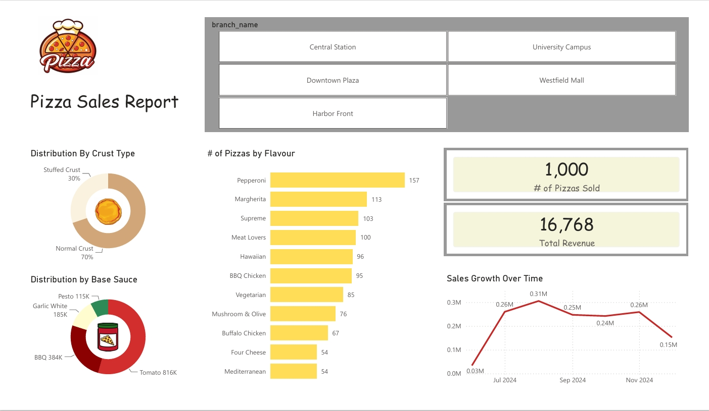
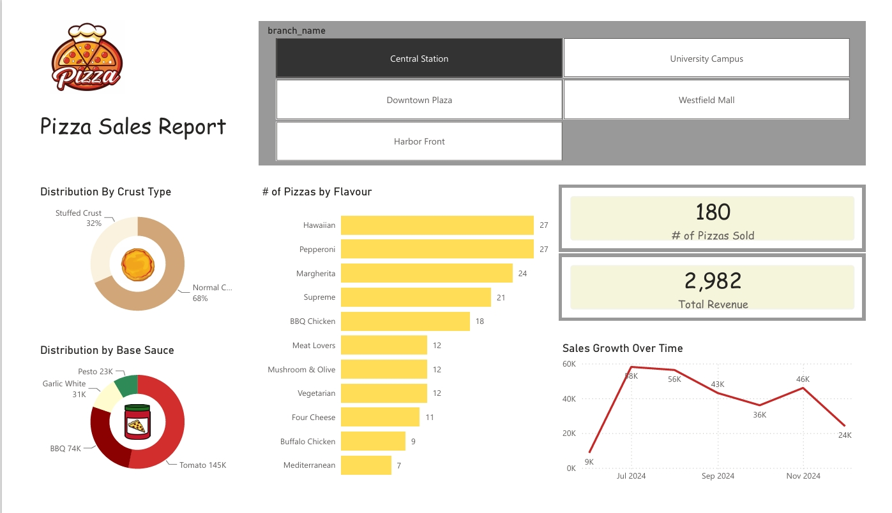

<p align="center">
  <h1 align="center">🍕 Pizza Sales Report</h1>
</p>

<p align="center">
  <b>An interactive Power BI dashboard analysing pizza sales across 5 branches from June–December 2024.</b><br>
  Branch Filtering · Flavour Analysis · Revenue Tracking · Crust & Sauce Breakdown
</p>

<p align="center">
  
</p>

<p align="center">
  
  
  
  
  
</p>

<p align="center">
  
  
  
  
  
</p>

---

## 📸 Dashboard Preview

<p align="center">
  
</p>

<p align="center">
  
</p>

---

## 📋 Table of Contents

- [Quick Start](#quick-start)
- [Project Overview](#project-overview)
- [Dashboard Features](#dashboard-features)
- [Key Insights](#key-insights)
- [Data Model](#data-model)
- [DAX Measures & Power Query](#dax-measures--power-query)
- [Tech Stack](#tech-stack)
- [Repository Structure](#repository-structure)
- [Data Sources](#data-sources)
- [Installation Guide](#installation-guide)
- [How to Use the Dashboard](#how-to-use-the-dashboard)
- [Metrics Reference](#metrics-reference)
- [Troubleshooting](#troubleshooting)
- [Future Improvements](#future-improvements)
- [Contributing](#contributing)
- [Authors](#authors)
- [Acknowledgments](#acknowledgments)

---

## ⚡ Quick Start

> **Prerequisites:** Power BI Desktop (any version from 2023 onwards), Windows 10/11, minimum 4 GB RAM.

```bash
git clone https://github.com/saumyaprajapati/Projects---1.git
cd Projects---1
# Open the .pbix file directly in Power BI Desktop
```

The `.pbix` file is fully self-contained — no external database connection or additional setup is required. Simply open it and the dashboard loads immediately with the pre-embedded dataset.

---

## 📊 Project Overview

### What is this Dashboard?

The Pizza Sales Report is a single-page Power BI dashboard built to monitor and compare pizza sales performance across five branch locations over a seven-month period (June–December 2024). It provides a consolidated view of revenue, volume, flavour preferences, crust type distribution, and monthly growth trends — all filterable by branch with a single click.

The dataset was used exactly as provided, with no additional columns, measures, or data cleaning applied. Every visual in this report is powered by the raw source data.

### Problem Statement

This dashboard was built to answer the following business questions:

- Which pizza flavours sell the most across all branches, and does the ranking shift when filtered to a single branch?
- How is revenue distributed across months, and which month recorded the highest and lowest sales?
- What proportion of customers prefer stuffed crust versus normal crust?
- Which base sauce dominates orders, and how does the sauce mix vary by branch?

### Key Metrics at a Glance

| Metric | Value (All Branches) |
|---|---|
| 🍕 Total Pizzas Sold | 1,000 |
| 💰 Total Revenue | 16,768 |
| 🏪 Number of Branches | 5 |
| 🧀 Top Flavour | Pepperoni (157 units) |
| 📅 Peak Month | August 2024 (0.31M) |
| 🍅 Top Base Sauce | Tomato (816K) |

### Why Power BI?

- Power BI's slicer panel allows branch-level filtering without duplicating the report page, keeping the design clean and scalable.
- The built-in donut chart and horizontal bar chart visuals render crust type and flavour distributions with no custom code.
- Cross-filtering between visuals means clicking any flavour bar automatically filters all other charts on the page.
- The line chart's built-in time-axis formatting handles the month-over-month growth view natively.
- Power BI Desktop is free, making this report easy to share and open by anyone without a licence for simple viewing via Power BI Service.

---

## 🎛️ Dashboard Features

### Slicers / Filters

| Name | Location | Options | Default |
|---|---|---|---|
| Branch Name | Top centre panel | Central Station, University Campus, Downtown Plaza, Westfield Mall, Harbor Front | All (no selection) |

### Charts & Visuals

**Distribution by Crust Type (Donut Chart)** — This donut chart sits in the top-left quadrant and breaks down all orders into two crust categories. Across all branches, Normal Crust accounts for 70% of orders while Stuffed Crust accounts for the remaining 30%. When filtered to Central Station specifically, the Stuffed Crust share rises slightly to 32%, suggesting that branch draws customers with a stronger preference for the premium crust option.

**Distribution by Base Sauce (Donut Chart)** — Positioned below the crust chart, this donut shows the volume split across four sauce types: Tomato (816K), BBQ (384K), Garlic White (185K), and Pesto (115K). Tomato is the dominant sauce by a wide margin at the all-branches level. At Central Station, the same ranking holds — Tomato (145K), BBQ (74K), Garlic White (31K), Pesto (23K) — confirming a consistent customer preference pattern across the network.

**Number of Pizzas by Flavour (Horizontal Bar Chart)** — This bar chart in the centre panel ranks all 11 flavours by units sold. At the all-branches level, Pepperoni leads with 157 units, followed by Margherita (113), Supreme (103), Meat Lovers (100), Hawaiian (96), BBQ Chicken (95), Vegetarian (85), Mushroom & Olive (76), Buffalo Chicken (67), Four Cheese (54), and Mediterranean (54). When filtered to Central Station, the ranking reorders — Hawaiian and Pepperoni tie at the top with 27 units each, showing that branch-level preferences differ meaningfully from the network average.

**Sales Growth Over Time (Line Chart)** — This line chart in the bottom-right tracks monthly revenue from June through December 2024. The curve shows a sharp rise from 0.03M in June to a peak of 0.31M in August, followed by a decline to 0.25M in September, a dip to 0.24M in October, a partial recovery to 0.26M in November, and a steep fall to 0.15M in December. The same seasonal pattern is visible at branch level — Central Station peaked at 58K in July before ending December at 24K.

**KPI Cards** — Two KPI cards in the top-right display the headline figures: total pizzas sold (1,000 at all-branches level; 180 at Central Station) and total revenue (16,768 at all-branches level; 2,982 at Central Station). These cards update dynamically with every branch slicer selection.

---

## 🔍 Key Insights

### Flavour Performance

- Pepperoni is the top-selling flavour overall with 157 units — 39% more than the third-ranked Supreme (103 units).
- Mediterranean and Four Cheese are the weakest performers, tied at 54 units each across all branches.
- At Central Station, Hawaiian displaces Pepperoni to share first place, suggesting a location-specific customer preference not visible in the aggregate view.
- BBQ Chicken outperforms Vegetarian (95 vs 85) across all branches, though both trail the top four by a significant margin.

### Revenue & Growth Trends

| Month | Revenue (All Branches) |
|---|---|
| June 2024 | 0.03M |
| July 2024 | 0.26M |
| August 2024 | 0.31M (Peak) |
| September 2024 | 0.25M |
| October 2024 | 0.24M |
| November 2024 | 0.26M |
| December 2024 | 0.15M (Lowest post-launch) |

- August 2024 was the single strongest month, generating 0.31M in revenue — more than 10x the opening month of June.
- December shows a sharp contraction to 0.15M, the weakest performance since the business launched, potentially indicating post-holiday or seasonal slowdown.
- November showed a brief recovery to 0.26M before the December decline, suggesting a short-lived demand spike — possibly tied to promotions or foot traffic events.

### Crust & Sauce Preferences

- Normal Crust is the clear default across the network at 70%, but Stuffed Crust's 30% share is commercially significant and should not be treated as a niche option.
- Tomato sauce dominates at 816K volume — more than double BBQ (384K) and over four times Garlic White (185K).
- Pesto is the least-ordered sauce at 115K, less than one-seventh of Tomato volume, indicating limited demand for this option across all five branches.

### Branch-Level Concentration

- Central Station alone accounts for 180 of the 1,000 total pizzas sold (18% of network volume) and 2,982 of the 16,768 total revenue (approximately 17.8%).
- The branch slicer makes it straightforward to run this same comparison for any of the remaining four branches without duplicating any report pages.

---

## 🗂️ Data Model

Since this project uses the dataset as provided with no additional tables, calculated columns, or relationships added, the data model is a flat single-table structure:

```
pizza_sales (flat table)
└── All fields used directly by visuals
    ├── branch_name          ← drives the slicer and cross-filter
    ├── pizza_flavour        ← powers the bar chart
    ├── crust_type           ← powers the crust donut chart
    ├── base_sauce           ← powers the sauce donut chart
    ├── order_date           ← powers the time-series line chart
    ├── quantity             ← aggregated for KPI: # of Pizzas Sold
    └── revenue              ← aggregated for KPI: Total Revenue
```

No star schema, no dimension tables, no relationships configured. All visuals bind directly to columns in the single source table.

---

## 🧮 DAX Measures & Power Query

### DAX Measures

No custom DAX measures were created for this project. All KPI card values (total pizzas sold and total revenue) are driven by implicit measures — Power BI's built-in `SUM` and `COUNT` aggregations applied directly to the dataset columns via the visual field wells.

### Power Query / M Transformations

No Power Query transformations were applied. The dataset was loaded into Power BI exactly as provided, with no type changes, column removals, null handling, or reshaping steps performed. The data was used in its original form from the source file.

---

## 🛠️ Tech Stack

| Tool | Version | Purpose |
|---|---|---|
| Power BI Desktop | 2023+ | Dashboard design, visual authoring, slicer logic |
| Source Dataset | As provided | Raw pizza sales transaction data |

---

## 📁 Repository Structure

```
Projects---1/
├── Pizza Sales Report.pbix     ← Main Power BI report file
├── screenshots/
│   ├── Dashboard-1.png         ← All-branches view
│   └── Dashboard-2.png         ← Central Station filtered view
└── README.md                   ← This file
```

| File | Description |
|---|---|
| `Pizza Sales Report.pbix` | Self-contained Power BI file with embedded dataset and all visuals |
| `screenshots/Dashboard-1.png` | Full dashboard with no branch filter applied |
| `screenshots/Dashboard-2.png` | Dashboard filtered to Central Station branch |
| `README.md` | Project documentation |

---

## 📦 Data Sources

| Table | Rows | Key Columns |
|---|---|---|
| pizza_sales | ~1,000 orders | branch_name, pizza_flavour, crust_type, base_sauce, order_date, quantity, revenue |

- **Date range:** June 2024 – December 2024
- **Branches covered:** Central Station, University Campus, Downtown Plaza, Westfield Mall, Harbor Front
- **Revenue units:** Assumed to be in local currency as provided in the source dataset
- **No data cleaning or transformation was performed** — the dataset is embedded in the `.pbix` file exactly as originally supplied

---

## 🚀 Installation Guide

### Prerequisites

| Requirement | Version | Notes |
|---|---|---|
| Power BI Desktop | 2023 or later | Free download from Microsoft |
| Operating System | Windows 10 / 11 | Power BI Desktop is Windows-only |
| RAM | 4 GB minimum | 8 GB recommended for smooth interaction |

### Steps

1. Clone or download the repository:
```bash
git clone https://github.com/saumyaprajapati/Projects---1.git
```

2. Navigate to the project folder:
```bash
cd Projects---1
```

3. Open the report file in Power BI Desktop:
```bash
start "Pizza Sales Report.pbix"
```

4. The dashboard loads immediately — no data source credentials or gateway configuration required.

---

## 🖱️ How to Use the Dashboard

### Filtering by Branch

Click any branch button in the `branch_name` slicer panel at the top of the report. The KPI cards, bar chart, donut charts, and line chart all update simultaneously to reflect only that branch's data. To return to the all-branches view, click the selected branch again to deselect it, or use the slicer's clear button (eraser icon in the top-right corner of the slicer).

### Multi-Branch Selection

Hold **Ctrl** and click multiple branch buttons to compare a custom subset of branches — for example, selecting only Central Station and Downtown Plaza shows aggregated metrics for those two locations combined.

### Cross-Filtering Between Visuals

Clicking any bar in the flavour chart filters the donut charts and line chart to show data only for that flavour. Similarly, clicking a segment in the crust or sauce donut highlights the corresponding subset across all other visuals on the page.

### Hovering for Exact Values

Hovering over any data point on the line chart displays a tooltip with the exact monthly revenue figure. Hovering over a bar in the flavour chart shows the precise unit count for that flavour.

### Tips & Tricks

- Use **Ctrl+Click** on the branch slicer to select multiple branches without losing your current selection.
- Double-click a donut segment to isolate it and temporarily suppress all other segments — useful for focused storytelling in presentations.
- The KPI cards at top-right are the fastest way to verify whether a branch filter is active — the numbers drop significantly from the all-branches totals when a single branch is selected.
- Power BI's **Focus Mode** (the expand icon on any visual) gives a full-screen view of any single chart for deeper inspection.

---

## 📐 Metrics Reference

| Metric | Definition |
|---|---|
| # of Pizzas Sold | Total count of individual pizza units sold across all (or filtered) orders |
| Total Revenue | Sum of revenue values across all (or filtered) orders, in source currency units |
| Distribution by Crust Type | Percentage split of orders between Normal Crust and Stuffed Crust |
| Distribution by Base Sauce | Volume split of orders across Tomato, BBQ, Garlic White, and Pesto sauces |
| # of Pizzas by Flavour | Count of units sold per pizza flavour, ranked descending |
| Sales Growth Over Time | Monthly aggregated revenue plotted as a continuous line from June to December 2024 |

---

## 🔧 Troubleshooting

| Problem | Quick Fix |
|---|---|
| `.pbix` file won't open | Ensure Power BI Desktop is installed (free at powerbi.microsoft.com). The file requires Desktop, not the browser version. |
| Visuals appear blank after selecting a branch | Click the eraser icon on the slicer to clear all filters, then reselect the branch. Occasionally a cached filter state causes blank visuals. |
| KPI cards show no data | This typically means the slicer has filtered to a branch with no matching records. Clear the slicer and reapply. |
| Line chart X-axis shows dates out of order | Go to the date field in the field well, set it to Date type (not Text), and Power BI will sort chronologically. |
| Report opens but all values show as zero | The embedded dataset may not have loaded correctly. Close and reopen the file, or check if Power BI prompted a data refresh dialog on open. |
| Slicer buttons are not clickable | The report may be in Edit mode. Switch to Reading View (View menu → Reading view) for full interactivity. |

---

## 🔮 Future Improvements

### Planned

- [ ] Add a date range slicer to allow filtering by custom month intervals rather than viewing the full June–December range only
- [ ] Build a second report page with a branch-vs-branch comparison table showing side-by-side KPIs for all five locations
- [ ] Add a tooltip page that shows flavour breakdown when hovering over a branch on a map visual
- [ ] Include a ranking visual that dynamically shows which branch holds the top revenue position each month
- [ ] Add a target line to the Sales Growth line chart to benchmark actual revenue against a hypothetical monthly target

### Under Consideration

- [ ] Connect to a live data source (SharePoint list or SQL table) so the dashboard updates automatically without re-importing
- [ ] Add conditional formatting to the flavour bar chart to highlight the top 3 and bottom 3 performers in distinct colours
- [ ] Publish the report to Power BI Service and embed it in a GitHub Pages site for public viewing without requiring Power BI Desktop
- [ ] Add a drillthrough page so clicking a flavour bar navigates to a detailed breakdown of that flavour's performance by branch and month

---

## 🤝 Contributing

Contributions are welcome. To propose a change or improvement:

1. Fork the repository
2. Create a feature branch:
```bash
git checkout -b feature/your-feature-name
```
3. Commit your changes using conventional commits:
```bash
git commit -m "feat: add branch comparison page"
git commit -m "fix: correct revenue aggregation for Westfield Mall"
git commit -m "docs: update README with new screenshots"
```
4. Push to your fork:
```bash
git push origin feature/your-feature-name
```
5. Open a Pull Request against the `main` branch with a clear description of what you changed and why.

**Data contribution requirements:**
- Any updated dataset must retain the same column names and data types as the original source
- New data must cover at least one complete calendar month to be useful for the time-series chart
- Do not introduce null values in the `branch_name`, `pizza_flavour`, or `revenue` columns

---

## 👩‍💻 Authors

**SAUMYA PRAJAPATI**
*Data Analyst · Power BI Developer*

[](https://github.com/saumyaprajapati)
[](https://www.linkedin.com/in/saumya-prajapati-38b676386)

---

## 🙏 Acknowledgments

- **Dataset** — provided as-is and used without modification; credit to the original data provider
- **Microsoft Power BI** — for the free Desktop application that made this dashboard possible without any licensing cost
- **shields.io** — for the dynamic badge system used throughout this README
- **Power BI Community** — for documentation, forums, and visual galleries that informed design decisions in this report

---

<p align="center">⭐ If you found this useful, please give it a star!</p>

<p align="center">
  <a href="../../issues/new?template=bug_report.md">Report Bug</a> ·
  <a href="../../issues/new?template=feature_request.md">Request Feature</a>
</p>
