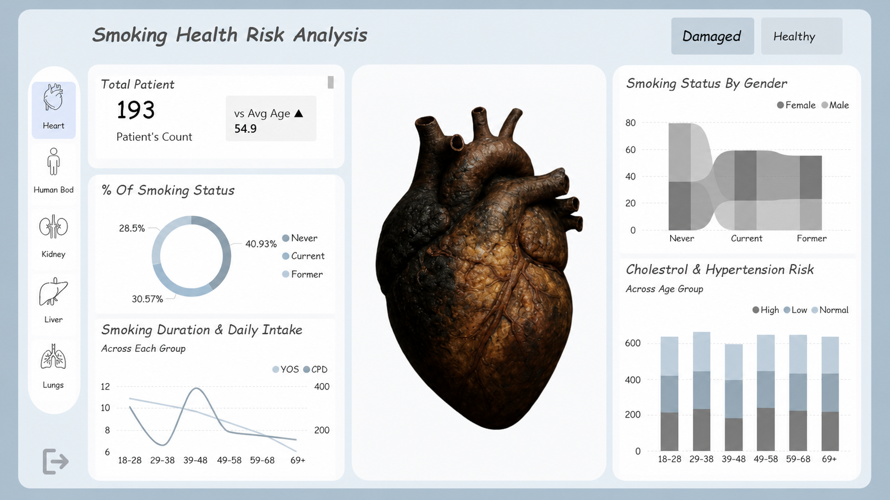

<p align="center">
  <h1 align="center">🫁 Smoke Scope Analysis</h1>
  <p align="center">
    <strong>An interactive Power BI dashboard analyzing the impact of smoking on human organs — Heart, Body, Kidney, Liver, and Lungs — across healthy and damaged states</strong>
  </p>
  <p align="center">
    Dynamic organ visuals · Smoking status distribution · Cholesterol & hypertension risk · Gender-wise analysis
  </p>
</p>

<p align="center">
  
  &nbsp;
  
  &nbsp;
  
</p>

<p align="center">
  
  &nbsp;
  
  &nbsp;
  
</p>

<p align="center">
  <a href="https://github.com/saumyaprajapati/Projects---1">
    
  </a>
  &nbsp;
  <a href="https://github.com/saumyaprajapati/Projects---1">
    
  </a>
  &nbsp;
  <a href="https://github.com/saumyaprajapati/Projects---1/stargazers">
    
  </a>
  &nbsp;
  <a href="https://github.com/saumyaprajapati/Projects---1/network/members">
    
  </a>
  &nbsp;
  <a href="https://github.com/saumyaprajapati/Projects---1/issues">
    
  </a>
</p>

---

## 📑 Table of Contents

- [Dashboard Preview](#-dashboard-preview)
- [Quick Start](#-quick-start)
- [Project Overview](#-project-overview)
- [Dashboard Features](#-dashboard-features)
- [Key Insights](#-key-insights)
- [How the Slicers Work](#-how-the-slicers-work)
- [DAX Measures](#-dax-measures)
- [Tech Stack](#-tech-stack)
- [Installation Guide](#-installation-guide)
- [How to Use the Dashboard](#-how-to-use-the-dashboard)
- [Metrics Reference](#-metrics-reference)
- [Future Improvements](#-future-improvements)
- [Contributing](#-contributing)
- [Authors](#-authors)
- [Acknowledgments](#-acknowledgments)

---

## 📸 Dashboard Preview

<p align="center">
  
</p>

---

## ⚡ Quick Start

Get the dashboard running in under 3 minutes:

```bash
# 1. Clone the repository
git clone https://github.com/saumyaprajapati/Projects---1.git

# 2. Open the Power BI file
#    Requires: Power BI Desktop (free download from Microsoft)
start "SmokeScope Analysis.pbix"

# 3. If prompted, refresh the data source
#    Data > Refresh All
```

> **Prerequisites**: [Power BI Desktop](https://powerbi.microsoft.com/desktop/) (free) · Windows 10/11
>
> The `.pbix` file is self-contained — all data and organ images are embedded. No database connection required.

---

## 🔎 Project Overview

### What is this Dashboard?

The **Smoke Scope Analysis** dashboard is an interactive, single-page Power BI report that visualizes how smoking damages five major human organs — **Heart, Human Body, Kidney, Liver, and Lungs**. Users can toggle between **Damaged** and **Healthy** states for each organ, and the dashboard dynamically updates the central organ image, KPI cards, and all supporting charts in real time.

### Problem Statement

Smoking is one of the leading causes of preventable disease worldwide. Medical researchers, health educators, and policy analysts need an intuitive visual tool to communicate the quantifiable damage smoking causes to specific organs. This dashboard addresses questions like:

- What percentage of the patient population are current, former, or never-smokers?
- How does smoking duration and daily cigarette intake vary across age groups?
- What is the distribution of cholesterol and hypertension risk for damaged vs. healthy organs?
- How does smoking status differ between male and female patients?

### Key Metrics at a Glance

| Metric                 | Value  |
| ---------------------- | ------ |
| 🫀 **Total Patients**  | 2500   |
| 📅 **Average Age**     | 54.9   |
| 🚬 **Current Smokers** | 29.32% |
| 🔄 **Former Smokers**  | 25.24% |
| 🚭 **Never Smokers**   | 45.44% |
| 🫁 **Organs Tracked**  | 5      |

### Why Power BI?

- **Dynamic image bookmarks** swap the central organ visual based on both slicer selections simultaneously
- **Button slicers** give a clean, app-like experience for toggling between organs and health states
- **DAX measures** power all KPI cards and chart data without any preprocessing
- **Conditional formatting** highlights risk levels across age groups instantly
- **Shareable `.pbix`** — the entire model, visuals, images, and data travel in one file

---

## 📊 Dashboard Features

### Central Organ Visual

The centerpiece of the dashboard is a high-fidelity anatomical image that dynamically changes based on **both slicers selected simultaneously**. For example:

| Left Slicer (Organ) | Top-Right Slicer (State) | Image Displayed      |
| ------------------- | ------------------------ | -------------------- |
| Heart _(default)_   | Damaged _(default)_      | Damaged heart image  |
| Heart               | Healthy                  | Healthy heart image  |
| Lungs               | Damaged                  | Damaged lungs image  |
| Lungs               | Healthy                  | Healthy lungs image  |
| Kidney              | Healthy                  | Healthy kidney image |
| _(and so on...)_    |                          |                      |

### KPI Cards

- **Total Patient** — count of patients in the filtered dataset
- **vs Avg Age** — average age of the patient cohort with a directional indicator

### Charts & Visuals

**% Of Smoking Status (Donut Chart)** — breakdown of Never, Current, and Former smokers as a percentage of the total patient population.

**Smoking Duration & Daily Intake (Dual-Axis Line Chart)** — tracks Years of Smoking (YOS) and Cigarettes Per Day (CPD) across each age group (18-28, 29-38, 39-48, 49-58, 59-68, 69+).

**Smoking Status By Gender (Ribbon Chart)** — compares the count of Female and Male patients across Never, Current, and Former smoking categories.

**Cholesterol & Hypertension Risk Across Age Group (Stacked Column Chart)** — displays the distribution of High, Low, and Normal cholesterol/hypertension risk levels segmented by age group.

---

## 💡 Key Insights

### Smoking Status Distribution With Respect To Damaged Heart

- **Current smokers** form the largest segment at **40.93%** of the total patient population, indicating active risk exposure
- **Former smokers** account for **30.57%**, a significant cohort with residual organ damage risk
- Only **28.5%** of patients have never smoked — suggesting the dataset skews toward higher-risk individuals

### Age & Smoking Behavior With Respect To Damaged Heart

- Smoking duration (YOS) peaks in the **middle age groups (29–48)** before tapering off in older cohorts
- Daily cigarette intake (CPD) shows a different curve, often peaking at younger ages, suggesting that longer-term smokers may reduce daily intake over time

### Gender Patterns With Respect To Damaged Heart

- Both **male and female** patients show similar distribution across Never, Current, and Former categories
- The "Current" category shows the largest gender gap, with one sex consistently showing higher active smoking rates

### Cholesterol & Hypertension Risk With Respect To Damaged Heart

- **High-risk** cholesterol and hypertension readings are concentrated in the **49–68 age band**, aligning with peak smoking duration years
- The **69+** group shows a notable shift, possibly reflecting survivor bias or reduced smoking in later years

---

## 🖱️ How the Slicers Work

### Left Slicer — Organ Selector

Located on the left side of the dashboard, this button slicer lets you select which organ to analyze. The **Heart** is selected by default.

| Button         | Icon | What Changes                                          |
| -------------- | ---- | ----------------------------------------------------- |
| **Heart**      | 🫀   | All charts and the central image update to Heart data |
| **Human Body** | 🧍   | Switches all visuals to full-body overview data       |
| **Kidney**     | 🫘   | Filters data and image to kidney metrics              |
| **Liver**      | 🟤   | Loads liver-specific charts and image                 |
| **Lungs**      | 🫁   | Displays lung data including smoking duration focus   |

### Top-Right Slicer — Health State Selector

Located in the top-right corner, this two-button slicer toggles between organ states. **Damaged** is selected by default.

| Button      | Effect                                                                  |
| ----------- | ----------------------------------------------------------------------- |
| **Damaged** | Shows the damaged organ image + data for patients with organ impairment |
| **Healthy** | Shows the healthy organ image + data for patients with healthy organ    |

> **Both slicers interact with each other** — selecting "Lungs" + "Healthy" renders the healthy lungs image and filters all charts accordingly.

---

## 📐 DAX Measures

Key measures powering the dashboard visuals:

```dax
Measures and Columns Formula

vs Avg Age =
VAR _CurrentAge = AVERAGE(health_dataset[Age])
VAR _OverallAge = CALCULATE(AVERAGE(health_dataset[Age]), ALL(health_dataset))
VAR _Diff = _CurrentAge - _OverallAge
RETURN
SWITCH(
    TRUE(),
    _Diff > 0, UNICHAR(9650) & " " & FORMAT(_CurrentAge, "0.0"),
    _Diff < 0, UNICHAR(9660) & " " & FORMAT(_CurrentAge, "0.0"),
    FORMAT(_CurrentAge, "0.0")
)


vs Avg BMI =
VAR _CurrentBMI = AVERAGE(health_dataset[BMI])
VAR _OverallBMI = CALCULATE(AVERAGE(health_dataset[BMI]), ALL(health_dataset))
VAR _Diff = _CurrentBMI - _OverallBMI
RETURN
SWITCH(
    TRUE(),
    _Diff > 0, UNICHAR(9650) & " " & FORMAT(_CurrentBMI, "0.0"),
    _Diff < 0, UNICHAR(9660) & " " & FORMAT(_CurrentBMI, "0.0"),
    FORMAT(_CurrentBMI, "0.0")
)


Age Group =
SWITCH(
    TRUE(),
    health_dataset[Age] <= 28, "18–28",
    health_dataset[Age] <= 38, "29–38",
    health_dataset[Age] <= 48, "39–48",
    health_dataset[Age] <= 58, "49–58",
    health_dataset[Age] <= 68, "59–68",
    "69+"
)
```

---

## 💻 Tech Stack

| Tool                                                         | Version | Purpose                               |
| ------------------------------------------------------------ | ------- | ------------------------------------- |
| [Power BI Desktop](https://powerbi.microsoft.com)            | Latest  | Report authoring, visuals, publishing |
| [DAX](https://learn.microsoft.com/dax/)                      | —       | Calculated measures and KPIs          |
| [Power Query (M)](https://learn.microsoft.com/powerquery-m/) | —       | Data transformation and cleaning      |
| [Microsoft Excel](https://microsoft.com/excel)               | —       | Raw source data format                |

---

## 🚀 Installation Guide

### Prerequisites

| Requirement      | Version          | Check                                                   |
| ---------------- | ---------------- | ------------------------------------------------------- |
| Power BI Desktop | Latest (free)    | [Download here](https://powerbi.microsoft.com/desktop/) |
| Windows          | 10 / 11          | —                                                       |
| RAM              | 4GB+ recommended | —                                                       |

### Step 1: Clone the Repository

```bash
git clone https://github.com/saumyaprajapati/Projects---1.git
```

### Step 2: Open the Report

Double-click `Smoke Scope Analysis.pbix` or open it from within Power BI Desktop via **File → Open**.

### Step 3: (Optional) Refresh Data

If you update the source Excel file with new patient data:

In Power BI Desktop: **Home → Refresh** to reload from the updated dataset.

### Step 4: Explore

Use the **Left Slicer** to switch between organs and the **Top-Right Slicer** to toggle between Damaged and Healthy states. All visuals update simultaneously.

---

## 🖥️ How to Use the Dashboard

### Selecting an Organ

- **Click any organ button** on the left panel (Heart, Human Body, Kidney, Liver, Lungs)
- The central anatomical image and all charts will immediately update to reflect the selected organ's data
- The **Heart** button is active by default on load

### Switching Health State

- **Click "Damaged"** (default) to see impaired organ data and the damaged organ visual
- **Click "Healthy"** to compare against the healthy baseline — the organ image and all metrics update

### Reading the Charts

- **Hover** over any segment of the donut chart to see exact smoking status percentages
- **Hover** over any point on the line chart to see YOS and CPD values for that specific age group
- **Click a bar** in the gender chart to cross-filter other visuals (if cross-filtering is enabled)
- **Age group bars** in the risk chart are color-coded: High (dark), Normal (medium), Low (light)

### Slicer Reference

| Slicer         | Location   | Options                                 | Default |
| -------------- | ---------- | --------------------------------------- | ------- |
| Organ Selector | Left panel | Heart, Human Body, Kidney, Liver, Lungs | Heart   |
| Health State   | Top-right  | Damaged, Healthy                        | Damaged |

---

## 📏 Metrics Reference

| Metric                | Definition                                                        |
| --------------------- | ----------------------------------------------------------------- |
| **Total Patients**    | Count of all patient records in the filtered dataset              |
| **Avg Age**           | Mean age of patients in the current filter context                |
| **Current Smoker %**  | Share of patients actively smoking                                |
| **Former Smoker %**   | Share of patients who smoked previously but have quit             |
| **Never Smoker %**    | Share of patients who have never smoked                           |
| **YOS**               | Years of Smoking — duration of smoking habit                      |
| **CPD**               | Cigarettes Per Day — average daily intake                         |
| **Cholesterol Risk**  | Classified as High, Normal, or Low based on clinical thresholds   |
| **Hypertension Risk** | Classified as High, Normal, or Low based on blood pressure levels |

---

## 🔮 Future Improvements

### Planned

- [ ] Add **drill-through page** for individual patient-level details
- [ ] Include **trend lines** for risk levels across age groups
- [ ] Build a **comparison mode** to view two organs side-by-side
- [ ] Add **tooltips with medical facts** about each organ's smoking risks
- [ ] Publish to **Power BI Service** for browser-based access

### Under Consideration

- [ ] Add a **lung capacity metric** using spirometry data
- [ ] Integrate **WHO smoking risk benchmarks** as reference lines on charts
- [ ] Build a **What-If parameter** to model risk reduction if a patient quits smoking
- [ ] Add **more organs**: Brain, Throat, Bladder
- [ ] Export as a **PDF health report** using Power BI's built-in export

---

## 🤝 Contributing

Contributions are welcome — whether that's new patient data, additional DAX measures, improved organ visuals, or new health metrics.

### Workflow

1. **Fork** the repository
2. **Branch** from `main`: `git checkout -b feat/your-feature`
3. **Make changes** — new data files go in `data/`, new organ images in `images/`
4. **Test** — open the `.pbix` and verify all slicer combinations render correctly
5. **Commit** using [Conventional Commits](https://www.conventionalcommits.org/):
   ```
   feat: add brain organ slicer option
   fix: correct kidney damaged image path
   docs: update metrics reference table
   ```
6. **Push** and open a **Pull Request** against `main`

### Data Contribution Requirements

- Dataset must include at minimum: `PatientID`, `Age`, `Gender`, `SmokingStatus`, `OrganAffected`, `OrganState`
- New organ images must be provided in both **Damaged** and **Healthy** variants
- Images should be consistent in style and resolution with existing organ visuals

---

## ✍️ Authors

**Prajapati Saumya** — Creator, Data Analyst & Dashboard Designer

[](https://github.com/saumyaprajapati)
&nbsp;
[](https://www.linkedin.com/in/saumya-prajapati-38b676386/)

---

## 👏 Acknowledgments

### Inspiration & References

- The medical and health informatics community for open smoking and organ health datasets
- Power BI Community forums for dynamic image switching using bookmarks and button slicers
- [SQLBI](https://sqlbi.com) — for definitive DAX and data modeling best practices

### Tools & Resources

[Power BI](https://powerbi.microsoft.com) · [Microsoft Excel](https://microsoft.com/excel) · [DAX Guide](https://dax.guide)

---

<p align="center">
  <strong>⭐ If you found this dashboard useful, please consider giving it a star!</strong>
</p>

<p align="center">
  <a href="https://github.com/saumyaprajapati/Projects---1/issues">Report Bug</a>
  ·
  <a href="https://github.com/saumyaprajapati/Projects---1/issues">Request Feature</a>
</p>

---
